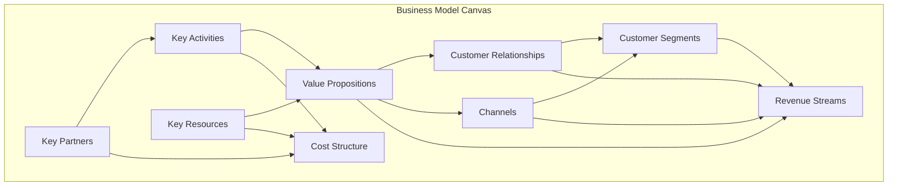
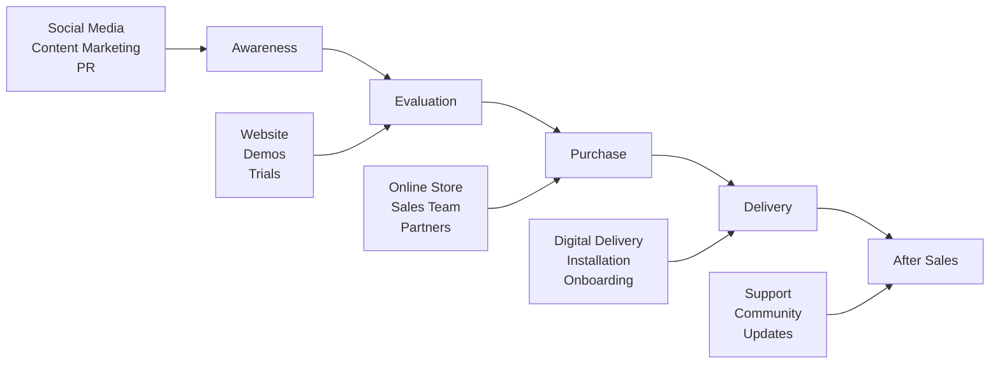
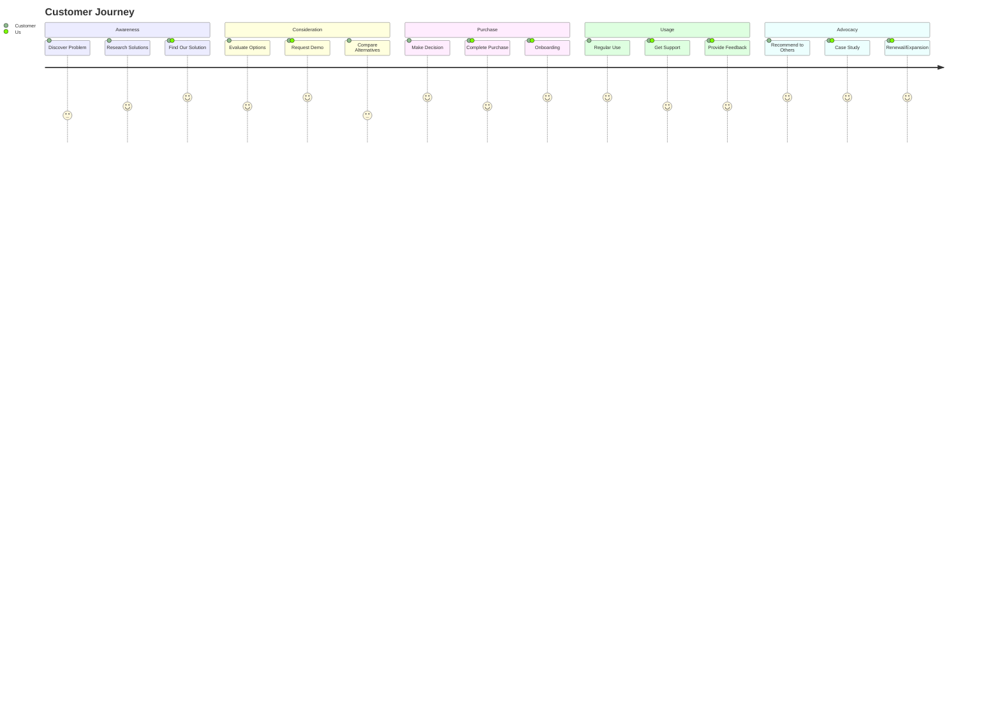
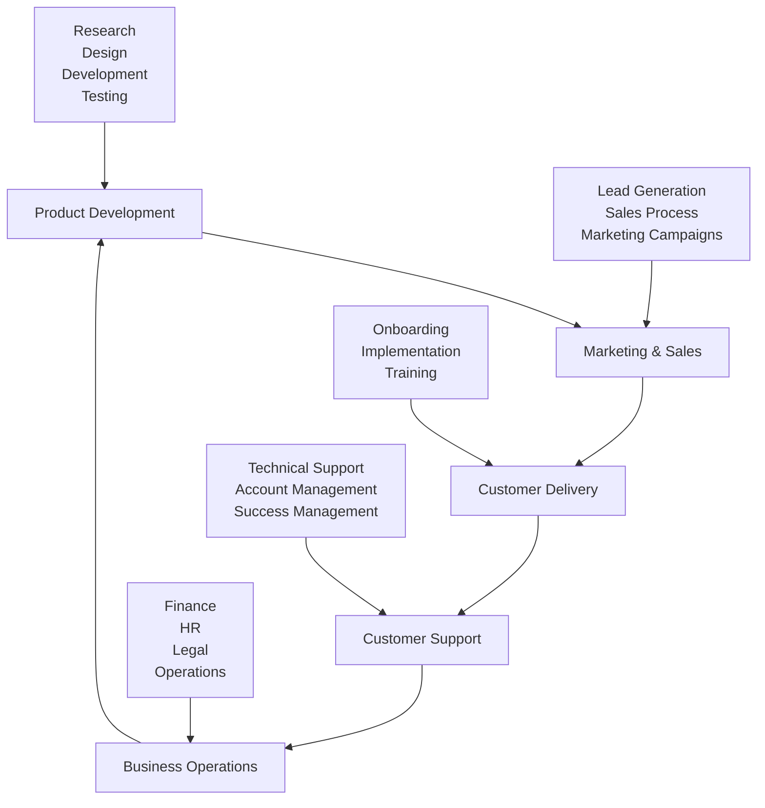
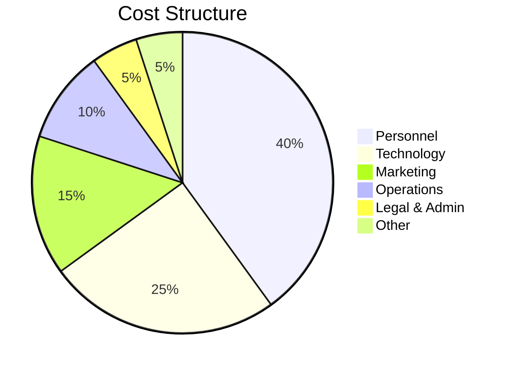

# Business Model Canvas: [Venture Name]

**Created**: [YYYY-MM-DD]
**Last Updated**: [YYYY-MM-DD]
**Status**: [Draft/Review/Approved]
**Version**: [1.0]

## Overview
This document captures the business model using the Business Model Canvas framework, providing a visual overview of how the venture creates, delivers, and captures value.

## Business Model Canvas

## 1. Customer Segments 👥
**Who are we creating value for? Who are our most important customers?**

### Primary Segments
- **[Segment Name]**: [Description, size, characteristics]
- **[Segment Name]**: [Description, size, characteristics]

### Secondary Segments
- **[Segment Name]**: [Description, size, characteristics]

### Customer Personas
- [[Customer Persona 1]]
- [[Customer Persona 2]]

## 2. Value Propositions 💎
**What value do we deliver to customers? Which problems are we solving?**

### Core Value Proposition
[Main value proposition statement]

### Value Proposition by Segment
| Customer Segment | Value Proposition | Pain Points Solved | Gains Created |
|------------------|-------------------|-------------------|---------------|
| [Segment 1] | [Value prop] | [Pain points] | [Gains] |
| [Segment 2] | [Value prop] | [Pain points] | [Gains] |

### Unique Selling Proposition (USP)
[What makes us different and better than alternatives]

## 3. Channels 📡
**Through which channels do we reach our customers?**

### Channel Strategy

### Channel Mix
- **Direct Channels**: [List and describe]
- **Indirect Channels**: [List and describe]
- **Partner Channels**: [List and describe]

## 4. Customer Relationships 🤝
**What type of relationship do we establish with each customer segment?**

### Relationship Types
- **[Segment 1]**: [Personal assistance/Self-service/Automated/Community/etc.]
- **[Segment 2]**: [Relationship type and rationale]

### Customer Journey

## 5. Revenue Streams 💰
**For what value are customers willing to pay? How do they prefer to pay?**

### Revenue Model
- **Primary Revenue Stream**: [Description, pricing model]
- **Secondary Revenue Streams**: [Additional revenue sources]

### Pricing Strategy
| Revenue Stream | Pricing Model | Price Point | Rationale |
|----------------|---------------|-------------|-----------|
| [Stream 1] | [Subscription/One-time/Usage-based] | [Price] | [Why this price] |
| [Stream 2] | [Model] | [Price] | [Rationale] |

### Revenue Projections
- **Year 1**: [Projection with assumptions]
- **Year 2**: [Projection with assumptions]
- **Year 3**: [Projection with assumptions]

## 6. Key Resources 🔧
**What key resources does our value proposition require?**

### Resource Categories
- **Physical**: [Equipment, facilities, inventory]
- **Intellectual**: [Patents, copyrights, data, brand]
- **Human**: [Key skills, expertise, team members]
- **Financial**: [Capital requirements, funding sources]

### Critical Resources
- [ ] **[Resource Name]**: [Description, importance, acquisition plan]
- [ ] **[Resource Name]**: [Description, importance, acquisition plan]

## 7. Key Activities 🎯
**What key activities does our value proposition require?**

### Activity Categories
- **Production**: [Manufacturing, development, delivery]
- **Problem Solving**: [Consulting, support, customization]
- **Platform/Network**: [Platform management, network effects]

### Core Activities

## 8. Key Partnerships 🤝
**Who are our key partners and suppliers?**

### Partnership Types
- **Strategic Alliances**: [Non-competitors working together]
- **Joint Ventures**: [Shared ownership partnerships]
- **Supplier Relationships**: [Key suppliers and vendors]
- **Coopetition**: [Partnerships with competitors]

### Key Partners
| Partner | Type | Value Provided | Value Received |
|---------|------|----------------|----------------|
| [Partner 1] | [Type] | [What they provide] | [What we provide] |
| [Partner 2] | [Type] | [What they provide] | [What we provide] |

## 9. Cost Structure 💸
**What are the most important costs in our business model?**

### Cost Categories
- **Fixed Costs**: [Rent, salaries, insurance]
- **Variable Costs**: [Materials, commissions, transaction fees]
- **Economies of Scale**: [Costs that decrease with volume]
- **Economies of Scope**: [Costs shared across products/services]

### Major Cost Drivers

### Cost Optimization Opportunities
- [ ] **[Opportunity 1]**: [Description and potential savings]
- [ ] **[Opportunity 2]**: [Description and potential savings]

## Assumptions & Hypotheses
### Key Assumptions
- [ ] **[Assumption 1]**: [Description, validation method, risk level]
- [ ] **[Assumption 2]**: [Description, validation method, risk level]

### Validation Plan
- [ ] **Customer Interviews**: [Timeline, target number, key questions]
- [ ] **Market Research**: [Methods, timeline, success criteria]
- [ ] **MVP Testing**: [Features, metrics, timeline]

## Next Steps
- [ ] Validate key assumptions through customer research
- [ ] Develop detailed financial projections
- [ ] Create go-to-market strategy
- [ ] Build MVP and test with early customers
- [ ] Refine business model based on learnings

## Related Documents
- [[Market Research Analysis]]
- [[Competitive Analysis]]
- [[Financial Projections]]
- [[Go-to-Market Strategy]]
- [[Customer Personas]]

## Changelog
- **[YYYY-MM-DD]**: Initial business model canvas creation
- **[YYYY-MM-DD]**: Updated based on customer research findings

---

**Tags**: #business-model #strategy #canvas #venture #ideation #foundation
**Created**: [YYYY-MM-DD]
**Last Updated**: [YYYY-MM-DD]
