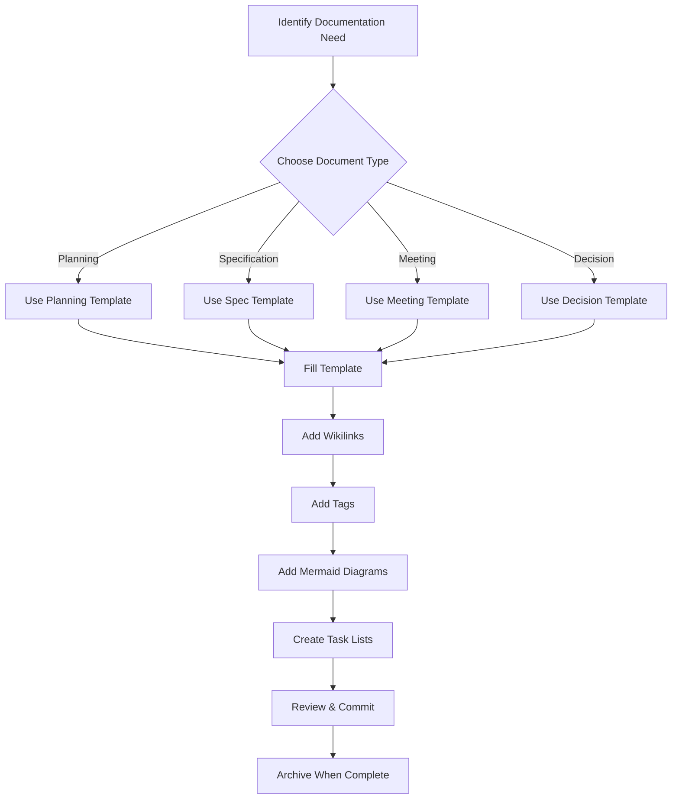
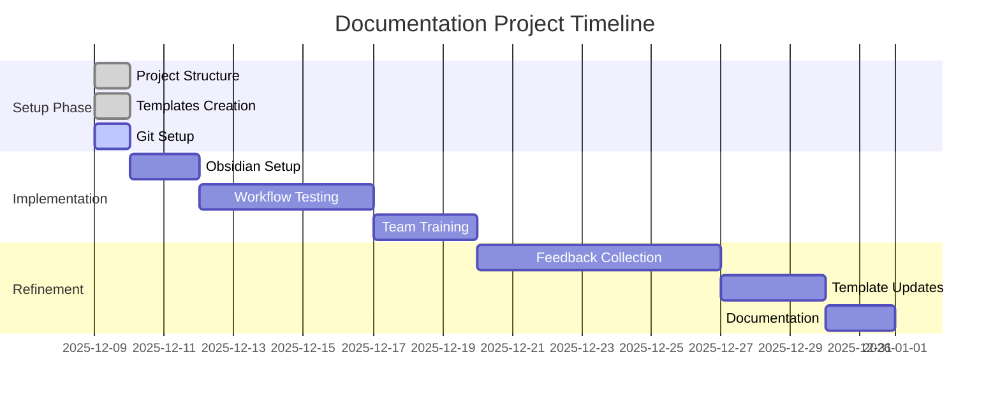
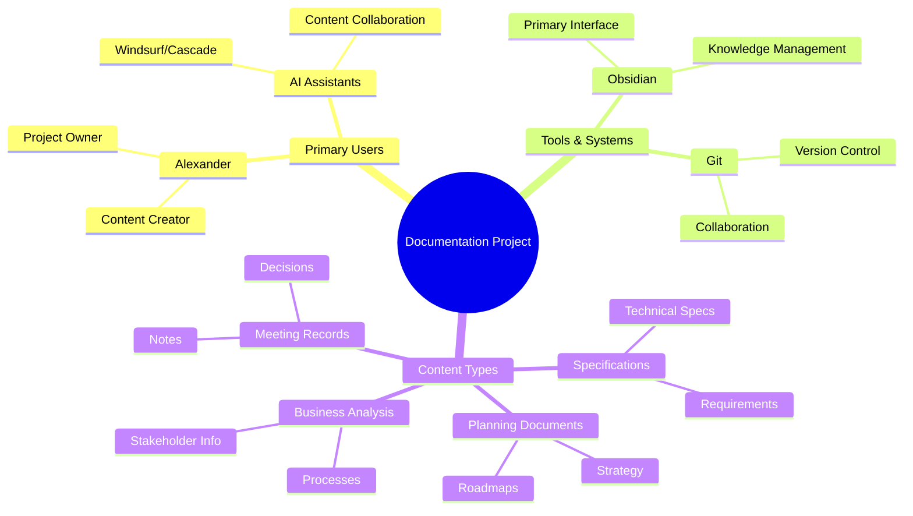

# Example Document: Project Planning Session

**Created**: 2025-12-09
**Last Updated**: 2025-12-09
**Status**: Draft
**Owner**: Alexander Bibighaus

## Overview
This document serves as an example of how to properly use Obsidian features in our documentation project. It demonstrates wikilinks, tags, task lists, Mermaid diagrams, and proper formatting.

## Project Context
This planning session is for the [[Documentation Project]] initiative. We're building on the foundation established in our [[project-plan-template]] and incorporating feedback from the [[2025-12-09-meeting-project-kickoff]].

> **Note**: This is an example document showing best practices for Obsidian integration.

## Current Status

### Completed Tasks
- [x] Set up project structure - @alexander - Completed: 2025-12-09
- [x] Create folder hierarchy - @alexander - Completed: 2025-12-09
- [x] Develop templates - @alexander - Completed: 2025-12-09

### In Progress
- [ ] Create Windsurf rules file - @alexander - Due: 2025-12-09
- [ ] Set up Git repository - @alexander - Due: 2025-12-09
- [ ] Document Obsidian setup process - @alexander - Due: 2025-12-10

### Upcoming Tasks
- [ ] Test workflow with real project - Due: 2025-12-15
- [ ] Gather feedback from team - Due: 2025-12-20
- [ ] Refine templates based on usage - Due: 2025-12-30

## Project Workflow

## Project Timeline

## Stakeholder Map

## Decision Matrix: Tool Selection

| Criteria | Obsidian | Notion | Confluence | Weight | Obsidian Score |
|----------|----------|--------|------------|--------|----------------|
| Markdown Support | ✅ Native | ⚠️ Limited | ❌ None | 25% | 10 |
| Local Files | ✅ Yes | ❌ Cloud Only | ❌ Cloud Only | 20% | 10 |
| Linking | ✅ Excellent | ✅ Good | ⚠️ Basic | 20% | 10 |
| Version Control | ✅ Git Compatible | ❌ No | ⚠️ Limited | 15% | 10 |
| Extensibility | ✅ Plugins | ⚠️ Limited | ⚠️ Limited | 10% | 10 |
| Collaboration | ⚠️ Via Git | ✅ Built-in | ✅ Built-in | 10% | 6 |

**Total Score**: Obsidian: 9.4/10

## Risk Assessment

### High Priority Risks
- **Learning Curve**: Team adoption of Obsidian features
  - *Mitigation*: Create comprehensive setup guide and examples
  - *Owner*: @alexander
  - *Due*: 2025-12-15

- **Consistency**: Maintaining documentation standards over time
  - *Mitigation*: Implement Windsurf rules and regular reviews
  - *Owner*: @alexander
  - *Due*: 2025-12-09

### Medium Priority Risks
- **Tool Lock-in**: Dependency on Obsidian-specific features
  - *Mitigation*: Use standard Markdown with minimal proprietary syntax
  - *Status*: Ongoing consideration

## Next Steps

### Immediate Actions (This Week)
- [ ] Complete Git repository setup - @alexander - Due: 2025-12-09
- [ ] Finalize Windsurf rules documentation - @alexander - Due: 2025-12-09
- [ ] Test workflow with sample project - @alexander - Due: 2025-12-11

### Short Term (Next 2 Weeks)
- [ ] Create Obsidian workspace configuration - Due: 2025-12-16
- [ ] Document best practices guide - Due: 2025-12-18
- [ ] Set up automated backup system - Due: 2025-12-20

### Long Term (Next Month)
- [ ] Evaluate workflow effectiveness - Due: 2025-01-09
- [ ] Gather user feedback and iterate - Due: 2025-01-15
- [ ] Plan integration with coding projects - Due: 2025-01-20

## Related Documents
- [[windsurf-rules]] - AI assistant guidelines for this project
- [[obsidian-setup]] - Detailed setup instructions
- [[project-plan-template]] - Template used for project planning
- [[meeting-notes-template]] - Template for meeting documentation

## Changelog
- **2025-12-09**: Initial document creation with full Obsidian feature demonstration

---

**Tags**: #example #planning #obsidian-features #documentation-standards #template #windsurf-rules
**Created**: 2025-12-09
**Last Updated**: 2025-12-09
