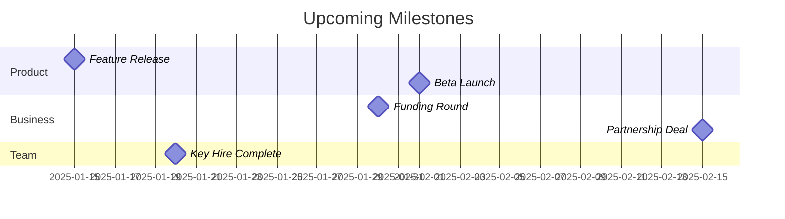
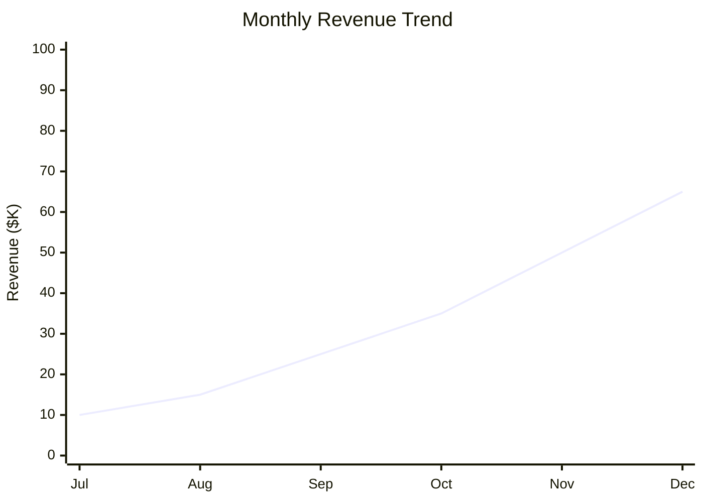
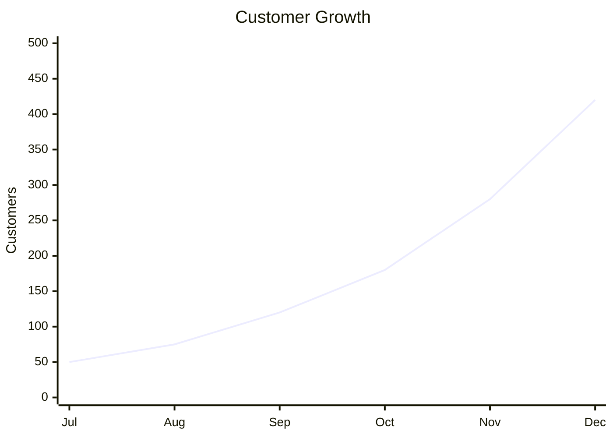

# Venture Dashboard: [Venture Name]

**Last Updated**: [YYYY-MM-DD]
**Current Stage**: [Ideation/Foundation/Growth/Maturity]
**Next Review**: [YYYY-MM-DD]

## 🎯 Mission & Vision
**Mission**: [What we do and why we exist]
**Vision**: [Where we're going and what we want to achieve]

## 📊 Key Metrics Dashboard

### Financial Health
| Metric | Current | Target | Trend | Status |
|--------|---------|--------|-------|--------|
| Monthly Revenue | $[Amount] | $[Target] | [↗️↘️➡️] | [🟢🟡🔴] |
| Monthly Burn Rate | $[Amount] | $[Target] | [↗️↘️➡️] | [🟢🟡🔴] |
| Runway (Months) | [Number] | [Target] | [↗️↘️➡️] | [🟢🟡🔴] |
| Customer LTV | $[Amount] | $[Target] | [↗️↘️➡️] | [🟢🟡🔴] |
| Customer CAC | $[Amount] | $[Target] | [↗️↘️➡️] | [🟢🟡🔴] |

### Growth Metrics
| Metric | Current | Target | Trend | Status |
|--------|---------|--------|-------|--------|
| Total Customers | [Number] | [Target] | [↗️↘️➡️] | [🟢🟡🔴] |
| Monthly New Customers | [Number] | [Target] | [↗️↘️➡️] | [🟢🟡🔴] |
| Churn Rate (%) | [Percentage] | [Target] | [↗️↘️➡️] | [🟢🟡🔴] |
| Net Promoter Score | [Score] | [Target] | [↗️↘️➡️] | [🟢🟡🔴] |
| Market Share (%) | [Percentage] | [Target] | [↗️↘️➡️] | [🟢🟡🔴] |

### Operational Metrics
| Metric | Current | Target | Trend | Status |
|--------|---------|--------|-------|--------|
| Team Size | [Number] | [Target] | [↗️↘️➡️] | [🟢🟡🔴] |
| Product Development Velocity | [Units] | [Target] | [↗️↘️➡️] | [🟢🟡🔴] |
| Customer Support Response Time | [Hours] | [Target] | [↗️↘️➡️] | [🟢🟡🔴] |
| System Uptime (%) | [Percentage] | [Target] | [↗️↘️➡️] | [🟢🟡🔴] |

## 🎯 Current Quarter OKRs

### Objective 1: [Objective Title]
**Key Results:**
- [ ] **KR1**: [Measurable result] - Current: [Progress] / Target: [Goal]
- [ ] **KR2**: [Measurable result] - Current: [Progress] / Target: [Goal]
- [ ] **KR3**: [Measurable result] - Current: [Progress] / Target: [Goal]

### Objective 2: [Objective Title]
**Key Results:**
- [ ] **KR1**: [Measurable result] - Current: [Progress] / Target: [Goal]
- [ ] **KR2**: [Measurable result] - Current: [Progress] / Target: [Goal]

### Objective 3: [Objective Title]
**Key Results:**
- [ ] **KR1**: [Measurable result] - Current: [Progress] / Target: [Goal]
- [ ] **KR2**: [Measurable result] - Current: [Progress] / Target: [Goal]

## 🚀 Current Initiatives

### Active Projects
- [ ] **[Project Name]** - Owner: @[Name] - Due: [Date] - Status: [On Track/At Risk/Blocked]
  - Progress: [Brief description]
  - Next Milestone: [Description and date]
  
- [ ] **[Project Name]** - Owner: @[Name] - Due: [Date] - Status: [On Track/At Risk/Blocked]
  - Progress: [Brief description]
  - Next Milestone: [Description and date]

### Upcoming Initiatives (Next 30 Days)
- [ ] **[Initiative Name]** - Start: [Date] - Owner: @[Name]
- [ ] **[Initiative Name]** - Start: [Date] - Owner: @[Name]

## ⚠️ Risks & Issues

### High Priority Issues
- **[Issue Title]** - Severity: [High/Medium/Low] - Owner: @[Name]
  - Description: [Brief description]
  - Impact: [Business impact]
  - Mitigation: [Action plan]
  - Due: [Resolution date]

### Risk Register
| Risk | Probability | Impact | Mitigation Strategy | Owner | Review Date |
|------|------------|--------|-------------------|-------|-------------|
| [Risk Description] | [H/M/L] | [H/M/L] | [Strategy] | @[Name] | [Date] |

## 💡 Recent Wins & Learnings

### This Month's Wins
- 🎉 **[Win Title]**: [Description and impact]
- 🎉 **[Win Title]**: [Description and impact]

### Key Learnings
- 📚 **[Learning Title]**: [What we learned and how it changes our approach]
- 📚 **[Learning Title]**: [What we learned and how it changes our approach]

## 📅 Upcoming Milestones

## 🔗 Quick Links

### Strategic Documents
- [[Business Model Canvas]]
- [[Market Research Analysis]]
- [[Competitive Analysis]]
- [[Go-to-Market Strategy]]

### Operational Documents
- [[Team Charter]]
- [[Process Documentation]]
- [[Customer Feedback Summary]]
- [[Financial Projections]]

### Recent Updates
- [[Latest Board Meeting Notes]]
- [[Monthly Team All-Hands]]
- [[Customer Advisory Board Meeting]]

## 📞 Key Contacts

### Internal Team
| Name | Role | Contact | Key Responsibility |
|------|------|---------|-------------------|
| [Name] | [Title] | [Email] | [Primary responsibility] |

### External Stakeholders
| Name | Organization | Role | Contact |
|------|-------------|------|---------|
| [Name] | [Company] | [Title] | [Email] |

## 🎯 Focus Areas This Week
- [ ] **Priority 1**: [Specific action item with owner and deadline]
- [ ] **Priority 2**: [Specific action item with owner and deadline]
- [ ] **Priority 3**: [Specific action item with owner and deadline]

## 📈 Trend Analysis

### Revenue Trend (Last 6 Months)

### Customer Growth

---

**Tags**: #dashboard #venture #metrics #okrs #kpis #overview
**Created**: [YYYY-MM-DD]
**Last Updated**: [YYYY-MM-DD]
