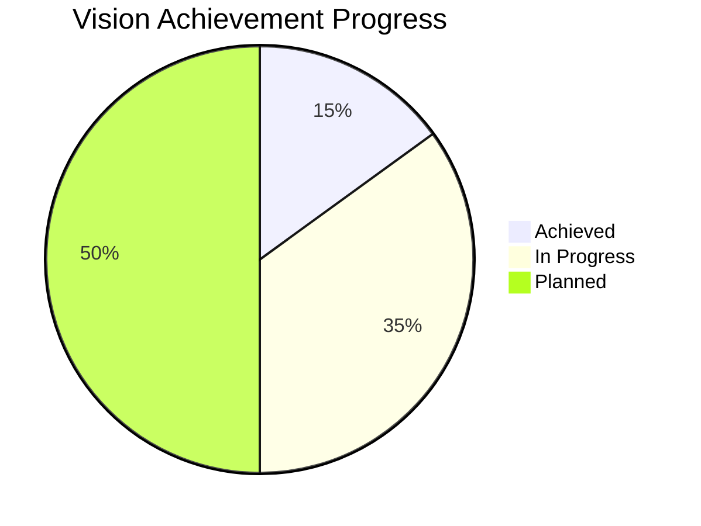
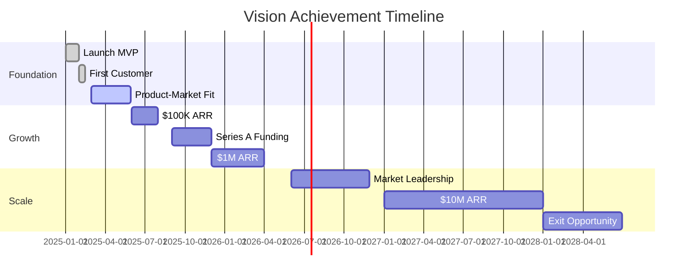

# Vision Board: [Venture Name]

**Created**: [YYYY-MM-DD]
**Last Updated**: [YYYY-MM-DD]
**Vision Timeline**: [3-5 years]
**Review Frequency**: [Quarterly]

## 🌟 Core Vision

### Mission Statement
> [Why your venture exists - the problem you solve and impact you create]

### Vision Statement  
> [Where you're going - the future state you're building toward]

### Core Values
1. **[Value 1]**: [Description of what this means in practice]
2. **[Value 2]**: [Description of what this means in practice]
3. **[Value 3]**: [Description of what this means in practice]

## 🎯 Success Vision Map

```mermaid
mindmap
  root((Vision Achievement))
    Financial Success
      Revenue Goals
        $[X]M ARR
        [X]% Growth Rate
        [X]% Profit Margin
      Valuation
        $[X]M Company Value
        [X]x Revenue Multiple
      Personal Wealth
        $[X]M Net Worth
        Financial Freedom
    
    Impact & Recognition
      Market Position
        #[X] in Category
        [X]% Market Share
        Industry Leader
      Awards & Recognition
        [Specific Awards]
        Media Coverage
        Speaking Opportunities
      Customer Impact
        [X]M Lives Improved
        [X]% Problem Solved
        Customer Success Stories
    
    Team & Culture
      Team Size
        [X] Employees
        [X] Countries
        Remote-First Culture
      Team Quality
        Top 1% Talent
        Diverse & Inclusive
        High Engagement
      Culture Goals
        Innovation Focus
        Learning Culture
        Work-Life Balance
    
    Personal Fulfillment
      Lifestyle Goals
        [Specific Lifestyle]
        Travel & Flexibility
        Family Time
      Growth Goals
        Industry Expert
        Thought Leader
        Mentor to Others
      Legacy Goals
        Industry Impact
        Next Generation
        Sustainable Business
```

## 💰 Financial Vision

### Revenue Milestones
| Timeframe | Revenue Target | Customers | Team Size | Valuation |
|-----------|---------------|-----------|-----------|-----------|
| Year 1 | $[X]K | [X] | [X] | $[X]M |
| Year 2 | $[X]M | [X] | [X] | $[X]M |
| Year 3 | $[X]M | [X] | [X] | $[X]M |
| Year 5 | $[X]M | [X] | [X] | $[X]M |

### Financial Freedom Goals
- **Personal Income**: $[X]/year passive income
- **Equity Value**: $[X]M in company equity
- **Investment Portfolio**: $[X]M diversified investments
- **Lifestyle Funding**: [Specific lifestyle goals funded]

## 🏆 Achievement Visualization

### Business Milestones
- [ ] **First $1K MRR** - Target: [Date] - Status: [Pending/Achieved]
- [ ] **First 100 Customers** - Target: [Date] - Status: [Pending/Achieved]
- [ ] **Product-Market Fit** - Target: [Date] - Status: [Pending/Achieved]
- [ ] **$1M ARR** - Target: [Date] - Status: [Pending/Achieved]
- [ ] **Series A Funding** - Target: [Date] - Status: [Pending/Achieved]
- [ ] **Market Leadership** - Target: [Date] - Status: [Pending/Achieved]

### Recognition Goals
- [ ] **Industry Award** - [Specific award name]
- [ ] **Media Feature** - [Target publication]
- [ ] **Conference Speaking** - [Target conference]
- [ ] **Thought Leadership** - [Specific platform/recognition]

### Personal Milestones
- [ ] **Financial Independence** - Target: [Date]
- [ ] **Dream Home** - [Location/description]
- [ ] **Travel Goals** - [Specific travel aspirations]
- [ ] **Family Goals** - [Personal family aspirations]

## 🎨 Visual Inspiration

### Lifestyle Vision
*[Add images or descriptions of desired lifestyle]*
- **Work Environment**: [Description of ideal work setup]
- **Living Situation**: [Description of desired home/location]
- **Daily Routine**: [Description of ideal daily life]
- **Travel & Experiences**: [Specific experiences desired]

### Business Vision
*[Add images or descriptions of business aspirations]*
- **Office/Workspace**: [Description of company environment]
- **Team Culture**: [Visual representation of team dynamics]
- **Customer Success**: [Images of happy customers/impact]
- **Industry Position**: [Visual representation of market leadership]

### Role Model Companies
| Company | What Inspires You | Specific Elements to Emulate |
|---------|-------------------|----------------------------|
| [Company 1] | [Inspiration] | [Specific practices/culture] |
| [Company 2] | [Inspiration] | [Specific practices/culture] |
| [Company 3] | [Inspiration] | [Specific practices/culture] |

## 📊 Progress Dashboard

### Current Status (Updated [Date])


### Key Metrics Progress
| Metric | Current | Target | Progress | Timeline |
|--------|---------|--------|----------|----------|
| Monthly Revenue | $[X] | $[X] | [X]% | [Date] |
| Total Customers | [X] | [X] | [X]% | [Date] |
| Team Members | [X] | [X] | [X]% | [Date] |
| Market Share | [X]% | [X]% | [X]% | [Date] |

### Milestone Timeline


## 🔥 Motivation & Inspiration

### Daily Affirmations
- "I am building a company that [specific impact statement]"
- "Every challenge brings me closer to [specific vision element]"
- "My venture creates value by [specific value creation]"

### Inspirational Quotes
> "[Quote that resonates with your vision]" - [Attribution]

> "[Quote about entrepreneurship/success]" - [Attribution]

> "[Quote about impact/purpose]" - [Attribution]

### Success Stories
**Role Model 1**: [Name/Company]
- **What they achieved**: [Specific achievement]
- **How it inspires you**: [Personal connection]
- **Lessons to apply**: [Actionable insights]

**Role Model 2**: [Name/Company]
- **What they achieved**: [Specific achievement]
- **How it inspires you**: [Personal connection]
- **Lessons to apply**: [Actionable insights]

## 🎯 Quarterly Vision Check-In

### This Quarter's Focus
**Primary Vision Elements**:
1. **[Element 1]**: [Specific actions and progress]
2. **[Element 2]**: [Specific actions and progress]
3. **[Element 3]**: [Specific actions and progress]

### Vision Alignment Assessment
- **Strongly Aligned**: [Areas where current work directly supports vision]
- **Partially Aligned**: [Areas needing better connection to vision]
- **Misaligned**: [Activities that don't support vision - consider stopping]

### Vision Refinements
**Updates Made This Quarter**:
- [Change 1]: [Reason for update]
- [Change 2]: [Reason for update]

**Lessons Learned**:
- [Learning 1]: [How it affects vision]
- [Learning 2]: [How it affects vision]

## 🔗 Connected Documents
- [[Business Model Canvas]] - How vision translates to business model
- [[Strategic Plan]] - Tactical execution of vision elements
- [[OKRs]] - Quarterly goals aligned with vision
- [[Team Charter]] - How team culture supports vision

## 📅 Vision Review Schedule
- **Daily**: 5-minute vision alignment check during morning routine
- **Weekly**: Review progress on vision-related goals
- **Monthly**: Update progress metrics and celebrate wins
- **Quarterly**: Comprehensive vision board review and updates
- **Annually**: Major vision refresh and long-term planning

---

**Tags**: #vision-board #goals #inspiration #long-term #personal #business
**Created**: [YYYY-MM-DD]
**Last Updated**: [YYYY-MM-DD]
