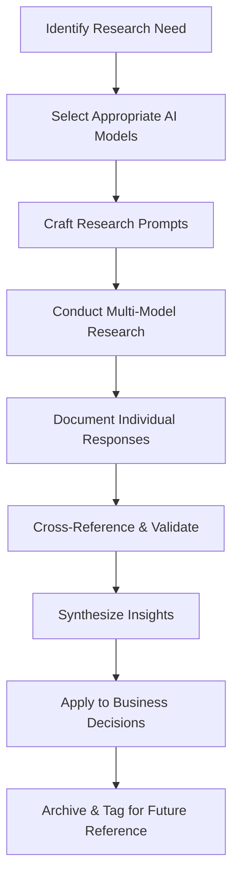

# AI Research Repository

This folder contains deep research, analysis, and insights generated by various AI models and LLMs. This serves as a knowledge repository for venture decision-making and strategic planning.

## Overview
AI-generated research provides valuable insights for market analysis, competitive intelligence, technical research, and strategic planning. This repository systematically organizes and preserves these insights for future reference and decision-making.

## Folder Structure

```
08-ai-research/
├── README.md                    # This file
├── market-research/            # Market analysis and industry insights
├── competitive-analysis/       # Competitor research and positioning
├── technical-research/         # Technology trends and technical analysis
├── strategic-insights/         # Business strategy and planning research
├── customer-research/          # Customer behavior and persona research
├── financial-analysis/         # Financial modeling and projections research
├── regulatory-compliance/      # Legal and regulatory research
├── trend-analysis/            # Industry trends and future predictions
├── product-research/          # Product development and feature research
└── synthesis/                 # Combined insights and cross-model analysis
```

## AI Model Sources

### Primary LLM Sources
- **GPT-4/ChatGPT**: General analysis, creative insights, strategic thinking
- **Claude (Anthropic)**: Deep analysis, research synthesis, ethical considerations
- **Gemini (Google)**: Technical research, data analysis, market insights
- **Perplexity**: Real-time research with citations and sources
- **Windsurf/Cascade**: Development-focused insights and technical analysis

### Specialized AI Tools
- **Research-specific**: Semantic Scholar AI, Consensus, Elicit
- **Market Analysis**: CB Insights, PitchBook AI features
- **Technical**: GitHub Copilot insights, Stack Overflow AI
- **Financial**: Bloomberg AI, financial modeling tools

## Document Naming Convention

### Format
`YYYY-MM-DD-[ai-model]-[research-type]-[topic].md`

### Examples
- `2025-12-09-gpt4-market-analysis-saas-trends.md`
- `2025-12-09-claude-competitive-analysis-fintech-landscape.md`
- `2025-12-09-perplexity-regulatory-research-data-privacy.md`
- `2025-12-09-synthesis-multi-model-customer-personas.md`

## Research Categories & Tags

### Research Types
- `#market-research` - Industry analysis, market sizing, trends
- `#competitive-analysis` - Competitor research, positioning
- `#technical-research` - Technology analysis, architecture insights
- `#customer-research` - User behavior, personas, journey mapping
- `#financial-analysis` - Business models, projections, valuations
- `#strategic-planning` - Business strategy, growth planning
- `#regulatory-research` - Compliance, legal considerations
- `#product-research` - Feature analysis, product development

### AI Model Tags
- `#gpt4` `#chatgpt` - OpenAI models
- `#claude` - Anthropic models
- `#gemini` - Google models
- `#perplexity` - Perplexity research
- `#windsurf` - Windsurf/Cascade insights
- `#multi-model` - Cross-model synthesis

### Quality & Confidence Tags
- `#high-confidence` - Well-researched, multiple sources
- `#medium-confidence` - Good analysis, some limitations
- `#exploratory` - Initial research, needs validation
- `#speculative` - Future predictions, high uncertainty

## Research Quality Standards

### Information to Include
1. **AI Model & Version**: Which AI generated the research
2. **Research Date**: When the research was conducted
3. **Prompt/Query**: Original question or research request
4. **Sources**: Any sources cited or referenced by the AI
5. **Confidence Level**: AI's stated confidence or limitations
6. **Validation Status**: Whether insights have been verified
7. **Business Relevance**: How this applies to your venture

### Research Template Structure
```markdown
# Research Title

**AI Model**: [Model name and version]
**Research Date**: [YYYY-MM-DD]
**Confidence Level**: [High/Medium/Low/Speculative]
**Business Relevance**: [High/Medium/Low]

## Research Query
[Original question or prompt given to AI]

## Key Findings
[Main insights and conclusions]

## Detailed Analysis
[Full research content]

## Sources & References
[Any sources cited by AI]

## Limitations & Caveats
[AI-stated limitations or uncertainties]

## Business Implications
[How this applies to your venture]

## Follow-up Questions
[Additional research needed]

## Validation Status
[Whether findings have been verified]
```

## Cross-Model Research Strategy

### Multi-Model Validation
- Ask the same question to multiple AI models
- Compare responses for consistency and gaps
- Synthesize insights into comprehensive analysis
- Identify areas of agreement and disagreement

### Specialized Model Usage
- **GPT-4**: Creative strategy, general business analysis
- **Claude**: Deep research, ethical considerations, detailed analysis
- **Perplexity**: Current events, real-time data, sourced research
- **Gemini**: Technical analysis, data interpretation
- **Domain-specific AIs**: Industry-specific insights

### Research Workflow


## Research Integration

### Link to Business Documents
- Connect research to relevant business model elements
- Reference in decision records and strategic plans
- Use insights to update market analysis and competitive positioning
- Inform product development and feature prioritization

### Regular Research Reviews
- **Weekly**: Review new research for immediate insights
- **Monthly**: Synthesize research themes and patterns
- **Quarterly**: Update strategic documents based on research
- **Annually**: Archive outdated research and refresh key analyses

## Best Practices

### Research Prompting
- Be specific about your venture context
- Ask for sources and confidence levels
- Request multiple perspectives or scenarios
- Follow up with clarifying questions

### Quality Control
- Cross-reference AI insights with authoritative sources
- Validate key claims through independent research
- Note any biases or limitations in AI responses
- Update research as new information becomes available

### Organization & Retrieval
- Use consistent tagging for easy discovery
- Create index documents for major research themes
- Link related research pieces together
- Maintain a research changelog for tracking updates
