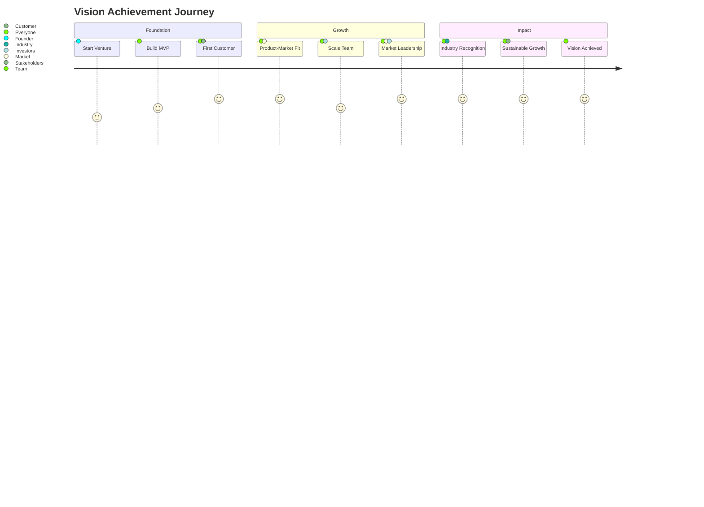

# Vision Board & Inspiration

This folder contains visual inspiration, aspirational goals, and motivational content to keep your venture's vision alive and inspiring throughout the journey.

## Overview
A vision board serves as a powerful visual reminder of your venture's ultimate goals, values, and aspirations. It combines images, quotes, metrics, and visual representations of success to maintain motivation and clarity during challenging times.

## Folder Structure

```
09-vision-board/
├── README.md                    # This file
├── venture-vision-board.md      # Main digital vision board
├── annual-goals/               # Yearly aspirational goals
├── milestone-celebrations/     # Visual progress tracking
├── inspiration/               # Quotes, stories, role models
├── mood-boards/              # Visual style and brand inspiration
├── success-metrics/          # Visual representation of KPIs and goals
└── future-state/             # Long-term vision and exit scenarios
```

## Vision Board Components

### 🎯 **Core Vision Elements**
- **Mission Statement**: Why your venture exists
- **Vision Statement**: Where you're going
- **Values**: What guides your decisions
- **Success Metrics**: Quantified goals and milestones
- **Visual Goals**: Images representing desired outcomes

### 🖼️ **Visual Elements**
- **Lifestyle Goals**: Personal and professional aspirations
- **Business Milestones**: Revenue, customers, team size targets
- **Impact Goals**: How you want to change the world
- **Recognition**: Awards, media coverage, industry recognition
- **Team Vision**: The culture and people you want to build

### 📊 **Progress Tracking**
- **Milestone Celebrations**: Visual record of achievements
- **Progress Photos**: Before/after comparisons
- **Metric Visualizations**: Charts and graphs of growth
- **Timeline Views**: Journey from start to current state

## Digital Vision Board Features

### Obsidian Integration
- **Visual Embedding**: Images and diagrams directly in markdown
- **Link Integration**: Connect vision elements to business plans
- **Tag System**: Organize by timeframe, category, and priority
- **Daily Notes**: Regular vision check-ins and alignment

### Mermaid Visualizations
- **Goal Hierarchies**: Mind maps of interconnected goals
- **Timeline Views**: Gantt charts of milestone progression
- **Success Metrics**: Visual dashboards of key numbers
- **Journey Maps**: Path from current state to vision

## Vision Board Types

### 1. **Master Vision Board**
- Comprehensive overview of all aspirations
- 3-5 year vision with major milestones
- Personal and professional goals integrated
- Updated quarterly with progress and refinements

### 2. **Annual Focus Board**
- Current year's specific goals and targets
- Quarterly milestones and checkpoints
- Visual progress tracking
- Monthly review and updates

### 3. **Milestone Celebration Board**
- Visual record of achievements and wins
- Before/after comparisons
- Team celebrations and recognition
- Investor and stakeholder updates

### 4. **Inspiration & Mood Boards**
- Visual style and brand inspiration
- Role model companies and leaders
- Motivational quotes and stories
- Cultural and aesthetic aspirations

## Best Practices

### Visual Selection
- Choose images that evoke strong emotional responses
- Include both personal and professional aspirations
- Use high-quality, inspiring visuals
- Balance aspirational with achievable goals

### Regular Updates
- **Weekly**: Quick vision alignment check
- **Monthly**: Progress updates and metric refreshes
- **Quarterly**: Major vision board reviews and updates
- **Annually**: Complete vision board refresh

### Integration with Planning
- Link vision elements to strategic plans
- Reference in decision-making processes
- Use in team meetings and presentations
- Include in investor and stakeholder communications

## Measurement & Tracking

### Success Metrics
- **Quantitative Goals**: Revenue, customers, team size
- **Qualitative Aspirations**: Culture, impact, recognition
- **Personal Milestones**: Lifestyle and growth goals
- **Timeline Targets**: When goals should be achieved

### Progress Visualization


## Tags for Vision Content
- **Timeframe**: `#short-term`, `#medium-term`, `#long-term`
- **Category**: `#financial`, `#personal`, `#team`, `#impact`, `#recognition`
- **Status**: `#aspirational`, `#in-progress`, `#achieved`
- **Priority**: `#core-vision`, `#stretch-goal`, `#nice-to-have`
