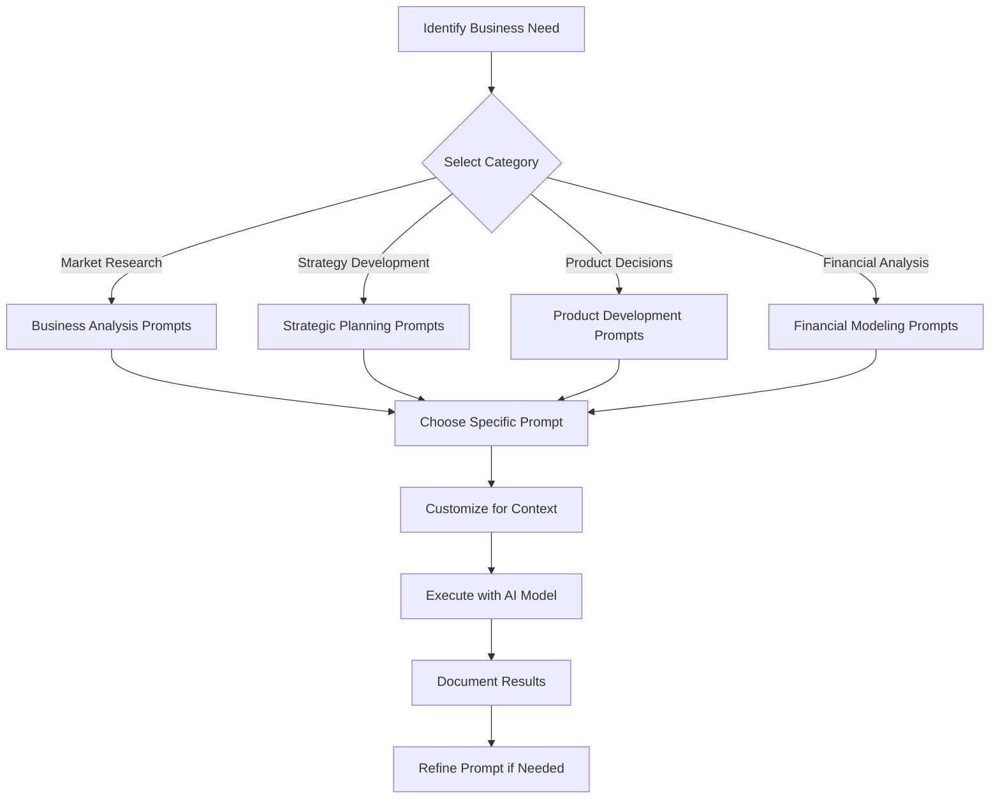

# LLM Prompt Library

This folder contains a curated collection of high-quality prompts for various AI models, organized by purpose and optimized for consistent, valuable outputs in venture management and business analysis.

## Overview
A well-organized prompt library accelerates AI research, ensures consistency across interactions, and captures proven prompt patterns that generate valuable insights. This system helps you leverage AI more effectively for strategic decision-making.

## Folder Structure

```
10-prompt-library/
├── README.md                    # This file
├── business-analysis/          # Market research, competitive analysis
├── strategic-planning/         # Business strategy, planning prompts
├── product-development/        # Product research, feature analysis
├── financial-modeling/         # Financial analysis, projections
├── customer-research/          # Customer insights, personas
├── technical-analysis/         # Technology trends, architecture
├── content-creation/          # Marketing, documentation, writing
├── decision-support/          # Decision frameworks, analysis
├── data-analysis/             # Data interpretation, insights
└── meta-prompts/              # Prompts for creating better prompts
```

## Prompt Categories

### 🎯 **Business Analysis Prompts**
- Market sizing and opportunity analysis
- Competitive landscape research
- Industry trend identification
- SWOT analysis generation
- Business model evaluation

### 📊 **Strategic Planning Prompts**
- Strategic framework development
- OKR and goal setting
- Risk assessment and mitigation
- Scenario planning and modeling
- Growth strategy development

### 💡 **Product Development Prompts**
- Feature prioritization frameworks
- User experience analysis
- Product-market fit assessment
- Roadmap planning and validation
- Technical architecture guidance

### 💰 **Financial Analysis Prompts**
- Revenue model optimization
- Cost structure analysis
- Financial projection modeling
- Valuation methodologies
- Investment decision frameworks

### 👥 **Customer Research Prompts**
- Customer persona development
- Journey mapping and analysis
- Feedback analysis and synthesis
- Market segmentation strategies
- Customer acquisition optimization

## Prompt Structure Standards

### Template Format
```markdown
# [Prompt Title]

**Category**: [Business Analysis/Strategic Planning/etc.]
**AI Models**: [Which models work best with this prompt]
**Difficulty**: [Beginner/Intermediate/Advanced]
**Output Type**: [Analysis/Framework/List/Report/etc.]

## Purpose
[What this prompt is designed to achieve]

## Context Setup
[Background information to provide before the prompt]

## Core Prompt
```
[The actual prompt text]
```

## Follow-up Questions
[Suggested follow-up prompts to deepen the analysis]

## Example Output
[Sample of what good output looks like]

## Optimization Notes
[Tips for getting better results with this prompt]
```

### Quality Standards
- **Specificity**: Prompts should be specific about desired output format
- **Context**: Include relevant business context and constraints
- **Clarity**: Use clear, unambiguous language
- **Actionability**: Focus on generating actionable insights
- **Measurability**: Request specific metrics and data when possible

## Prompt Optimization Techniques

### Context Priming
- Provide relevant business background
- Specify your venture stage and industry
- Include constraints and limitations
- Define success criteria for the output

### Output Formatting
- Request specific formats (tables, lists, frameworks)
- Ask for confidence levels and limitations
- Specify desired length and detail level
- Request sources and validation suggestions

### Multi-Step Prompting
- Break complex analysis into steps
- Use follow-up prompts to deepen insights
- Chain prompts for comprehensive analysis
- Validate outputs across multiple interactions

## AI Model Specializations

### GPT-4/ChatGPT Strengths
- Creative problem solving and ideation
- Strategic thinking and frameworks
- Content creation and writing
- General business analysis

### Claude Strengths  
- Deep analytical thinking
- Ethical considerations and risk analysis
- Detailed research and synthesis
- Complex reasoning and logic

### Gemini Strengths
- Data analysis and interpretation
- Technical and scientific analysis
- Mathematical modeling
- Real-time information processing

### Perplexity Strengths
- Current events and trends
- Sourced research and citations
- Market data and statistics
- Fact-checking and validation

## Prompt Library Organization

### Naming Convention
`[category]-[purpose]-[complexity].md`

Examples:
- `business-analysis-market-sizing-intermediate.md`
- `strategic-planning-okr-development-beginner.md`
- `customer-research-persona-development-advanced.md`

### Tagging System
- **Category**: `#business-analysis`, `#strategic-planning`, `#product-dev`
- **Complexity**: `#beginner`, `#intermediate`, `#advanced`
- **AI Model**: `#gpt4`, `#claude`, `#gemini`, `#perplexity`
- **Output Type**: `#framework`, `#analysis`, `#report`, `#list`
- **Business Function**: `#marketing`, `#sales`, `#operations`, `#finance`

## Usage Workflow

### 1. Prompt Selection


### 2. Prompt Customization
- Add your specific business context
- Adjust complexity level as needed
- Specify output format preferences
- Include relevant constraints or limitations

### 3. Result Documentation
- Use AI research templates to document outputs
- Link results to relevant business documents
- Note prompt effectiveness and improvements
- Update prompt library based on learnings

## Prompt Development Process

### Creating New Prompts
1. **Identify Need**: Specific business question or analysis type
2. **Research Best Practices**: Review existing similar prompts
3. **Draft Initial Version**: Create first version of prompt
4. **Test with Multiple Models**: Validate across different AIs
5. **Refine Based on Results**: Improve clarity and effectiveness
6. **Document and Categorize**: Add to library with proper metadata

### Prompt Iteration
- Track which versions produce better results
- A/B test different phrasings and structures
- Collect feedback from team members using prompts
- Regular review and update of prompt effectiveness

## Integration with Research Workflow

### Connection to AI Research System
- Prompts link directly to research templates
- Results automatically reference source prompts
- Prompt effectiveness tracked over time
- Best prompts highlighted for team use

### Business Document Integration
- Prompts designed to support specific document types
- Results formatted for easy integration into templates
- Cross-references between prompts and business outcomes
- Prompt selection guides based on document needs

## Best Practices

### Prompt Writing
- Start with clear objectives
- Provide sufficient context
- Use specific, actionable language
- Request structured outputs
- Include validation criteria

### Library Maintenance
- Regular review and cleanup
- Version control for prompt improvements
- Team feedback integration
- Performance tracking and optimization

### Quality Control
- Test prompts with multiple AI models
- Validate outputs against known good results
- Peer review of new prompts
- Regular effectiveness assessments
