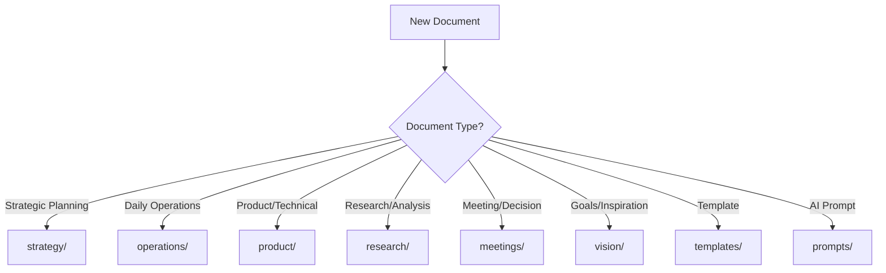

# Documentation Structure Reorganization Plan

## Current Issues
1. **Redundancy**: `03-business/` and `07-venture/` have significant overlap
2. **Numbering**: 10 numbered folders create artificial hierarchy
3. **Clarity**: Unclear distinction between "business" and "venture" content
4. **Navigation**: Too many top-level folders

## Proposed New Structure

### Core Organization (No Numbers)
```
docs-project/
├── strategy/              # Strategic planning, vision, business model
├── operations/           # Day-to-day business operations and processes
├── product/             # Product development, specifications, roadmap
├── meetings/            # Meeting notes, decisions, communications
├── research/            # Market research, competitive analysis, AI research
├── vision/              # Vision board, goals, inspiration
├── templates/           # Document templates and examples
├── prompts/             # AI prompt library
├── archive/             # Completed and outdated documents
├── assets/              # Images, diagrams, media files
└── _meta/               # Project configuration and standards
```

## Folder Purpose Clarification

### `strategy/` (Combines 01-planning + 07-venture)
**Purpose**: High-level strategic planning and business model
**Contents**:
- Business model canvas
- Strategic plans and roadmaps
- OKRs and goal setting
- Vision and mission statements
- Growth strategy
- Funding and investment planning

### `operations/` (Replaces 03-business)
**Purpose**: Day-to-day business operations and processes
**Contents**:
- Process documentation
- Stakeholder management
- Team structure and hiring
- Legal and compliance
- Financial operations
- Vendor and partner management

### `product/` (Replaces 02-specifications)
**Purpose**: Product development and technical specifications
**Contents**:
- Technical specifications
- Product requirements
- API documentation
- Architecture decisions
- Feature planning
- User experience design

### `research/` (Combines parts of 03-business + 08-ai-research)
**Purpose**: All research and analysis activities
**Contents**:
- Market research
- Competitive analysis
- Customer research
- AI-generated research
- Industry analysis
- Trend research

### `vision/` (Replaces 09-vision-board)
**Purpose**: Inspirational and aspirational content
**Contents**:
- Vision boards
- Goal visualization
- Milestone celebrations
- Inspiration and motivation
- Success metrics tracking

## Migration Plan

### Phase 1: Create New Structure
1. Create new folders with clear purposes
2. Update README files for each folder
3. Create migration mapping document

### Phase 2: Move Content
1. Move documents to appropriate new folders
2. Update internal links and references
3. Update windsurf-rules.md with new structure

### Phase 3: Cleanup
1. Remove old numbered folders
2. Update all templates with new folder references
3. Test all wikilinks and fix broken ones
4. Update Git history and commit changes

## Benefits of New Structure

### Clarity
- Clear functional separation
- No redundant folders
- Intuitive organization

### Scalability
- No artificial numbering limits
- Easy to add new categories
- Flexible organization

### Usability
- Faster navigation
- Clearer decision-making about document placement
- Better Obsidian graph view organization

## Content Mapping

### Current → New Mapping
- `01-planning/` → `strategy/`
- `02-specifications/` → `product/`
- `03-business/` → `operations/` + `research/`
- `04-meetings/` → `meetings/` (unchanged)
- `05-templates/` → `templates/` (unchanged)
- `06-archive/` → `archive/` (unchanged)
- `07-venture/` → `strategy/`
- `08-ai-research/` → `research/ai/`
- `09-vision-board/` → `vision/`
- `10-prompt-library/` → `prompts/`

## Updated Windsurf Rules

### New Folder Guidelines
- **strategy/**: Long-term planning, business model, strategic decisions
- **operations/**: Processes, team management, day-to-day business
- **product/**: Technical specs, product development, user experience
- **research/**: All analysis and research activities (market, competitive, AI)
- **meetings/**: All meeting notes, decisions, and communications
- **vision/**: Inspirational content, goals, progress tracking
- **templates/**: Reusable document templates
- **prompts/**: AI prompt library and optimization
- **archive/**: Completed or outdated content
- **assets/**: All media files and visual content

### Document Placement Decision Tree

