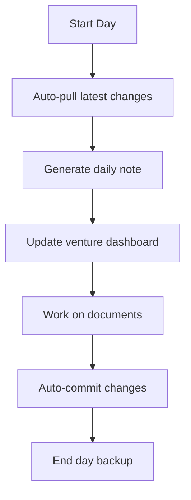
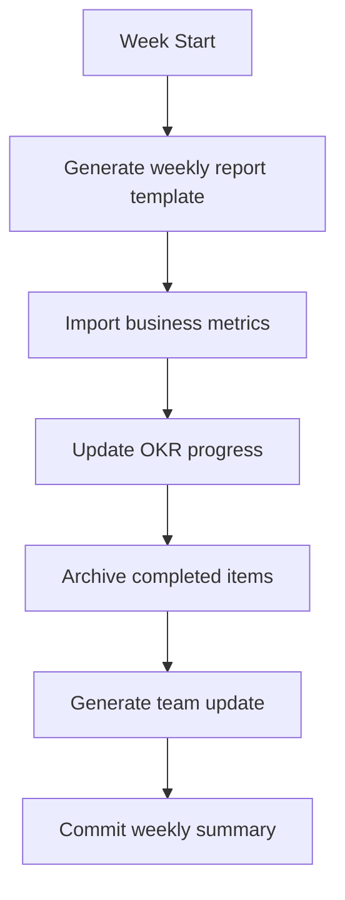
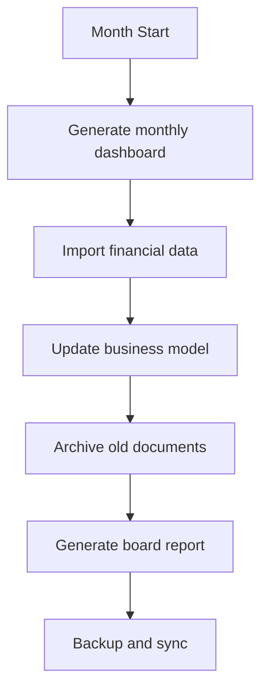

# Documentation Automation Setup

This guide outlines how to set up automated documentation generation and maintenance for your venture documentation project.

## Overview
Automation helps maintain consistency, reduces manual work, and ensures documentation stays current. This setup includes automated templates, content generation, and maintenance workflows.

## Automation Categories

### 1. Template Automation
**Goal**: Quickly create new documents with proper structure and metadata

#### Obsidian Templates Plugin
```yaml
# Template Configuration
template_folder: "05-templates"
date_format: "YYYY-MM-DD"
time_format: "HH:mm"
```

#### Template Hotkeys (Recommended)
- `Ctrl/Cmd + Shift + M`: Meeting notes template
- `Ctrl/Cmd + Shift + P`: Project plan template
- `Ctrl/Cmd + Shift + D`: Decision record template
- `Ctrl/Cmd + Shift + B`: Business model canvas

#### Templater Plugin (Advanced)
Install Templater for dynamic templates with:
- Auto-generated dates and times
- Dynamic file naming
- Calculated values (e.g., runway calculations)
- Integration with external data sources

### 2. Content Generation Automation

#### AI-Assisted Content Creation
**Windsurf Integration**:
- Use the `windsurf-rules.md` file to ensure consistent AI output
- Create document templates that guide AI content generation
- Set up prompts for common documentation tasks

**Example AI Prompts**:
```markdown
# Meeting Summary Generation
"Based on the meeting transcript, create a meeting summary using our meeting notes template. Include action items with owners and due dates."

# Market Research Analysis
"Analyze the provided market data and create a market research document following our business analysis template structure."

# Financial Projection Updates
"Update the financial projections based on the new customer acquisition data, maintaining our standard financial template format."
```

#### Automated Reporting
**Weekly/Monthly Reports**:
- Set up templates for regular business reviews
- Use data exports from business tools
- Create standardized metrics dashboards

### 3. Maintenance Automation

#### Git Automation (Obsidian Git Plugin)
```yaml
# Auto-commit settings
auto_commit_interval: 30  # minutes
commit_message: "docs: automated backup {{date}}"
auto_pull_interval: 60   # minutes
auto_push_interval: 120  # minutes
```

#### File Organization Automation
**Automated Archiving**:
- Set up rules to move completed documents to archive
- Use tags and metadata to trigger archival
- Create automated cleanup of old temporary files

**Link Maintenance**:
- Use Obsidian's link update features
- Set up regular link validation
- Automated broken link detection

### 4. Integration Automation

#### Business Tool Integrations
**CRM Integration**:
- Export customer data for analysis
- Generate customer persona updates
- Create automated customer feedback summaries

**Financial Tool Integration**:
- Import financial data for projections
- Generate automated financial reports
- Update venture dashboard metrics

**Project Management Integration**:
- Sync project status with documentation
- Generate project reports
- Update milestone tracking

## Setup Instructions

### Phase 1: Basic Template Automation
1. **Install Obsidian Plugins**:
   - Templates (Core plugin)
   - Templater (Community plugin)
   - Obsidian Git (Community plugin)

2. **Configure Templates**:
   ```bash
   # Set template folder
   Settings > Templates > Template folder location: "05-templates"
   
   # Set date/time formats
   Date format: YYYY-MM-DD
   Time format: HH:mm
   ```

3. **Set Up Hotkeys**:
   ```yaml
   # Hotkey assignments
   Insert template: Ctrl/Cmd + T
   Meeting template: Ctrl/Cmd + Shift + M
   Project template: Ctrl/Cmd + Shift + P
   ```

### Phase 2: Advanced Automation
1. **Install Templater Plugin**:
   ```javascript
   // Example dynamic template
   ---
   created: <% tp.date.now() %>
   updated: <% tp.date.now() %>
   status: draft
   owner: <% tp.system.prompt("Document owner") %>
   ---
   
   # <% tp.system.prompt("Document title") %>
   ```

2. **Set Up Git Automation**:
   ```yaml
   # Obsidian Git settings
   Vault backup interval: 30 minutes
   Auto commit message: "docs: {{hostname}} {{date}}"
   Auto pull: enabled
   Auto push: enabled
   ```

### Phase 3: Business Integration
1. **Data Export Automation**:
   - Set up regular exports from business tools
   - Create import scripts for common data formats
   - Establish data validation and cleaning processes

2. **Reporting Automation**:
   - Create templates for regular reports
   - Set up data visualization automation
   - Establish review and approval workflows

## Automation Workflows

### Daily Automation


### Weekly Automation


### Monthly Automation


## Automation Tools & Scripts

### Useful Obsidian Plugins
- **Templater**: Dynamic templates with JavaScript
- **Dataview**: Query and display data from notes
- **Calendar**: Visual calendar for daily notes
- **Kanban**: Project management boards
- **Advanced Tables**: Better table editing
- **Excalidraw**: Integrated diagramming
- **Mind Map**: Visual mind mapping

### External Automation Tools
- **Zapier/Make**: Connect business tools to documentation
- **GitHub Actions**: Automated workflows and deployments
- **Python Scripts**: Custom data processing and generation
- **Shortcuts (Mac)**: Quick document creation workflows

## Monitoring & Maintenance

### Automation Health Checks
- [ ] **Weekly**: Review auto-commit logs
- [ ] **Weekly**: Check for broken links
- [ ] **Monthly**: Validate data imports
- [ ] **Monthly**: Review automation effectiveness
- [ ] **Quarterly**: Update automation rules

### Performance Optimization
- Monitor vault size and performance
- Optimize large file handling
- Review and clean up automation logs
- Update plugins and configurations regularly

### Backup & Recovery
- Ensure automated backups are working
- Test recovery procedures regularly
- Maintain offline backups of critical documents
- Document automation dependencies

## Troubleshooting

### Common Issues
- **Sync conflicts**: Use Git merge strategies
- **Template errors**: Check Templater syntax
- **Performance issues**: Review plugin load and file sizes
- **Integration failures**: Validate API connections and data formats

### Recovery Procedures
- Git history for document recovery
- Plugin reset procedures
- Data re-import processes
- Manual backup restoration

---

**Tags**: #automation #setup #obsidian #git #templates #integration
**Created**: 2025-12-09
**Last Updated**: 2025-12-09
