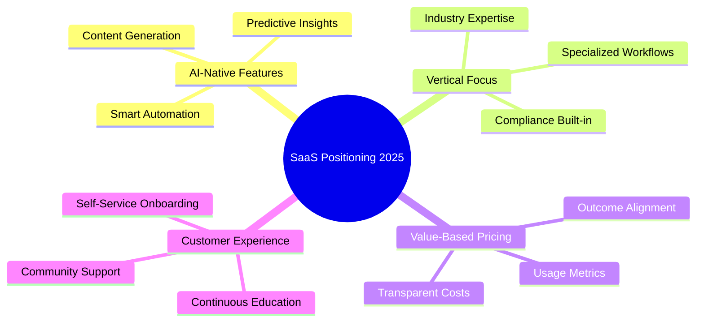

# AI Research: SaaS Market Trends 2025

**AI Model**: Example Multi-Model Analysis
**Research Date**: 2025-12-09
**Researcher**: Alexander Bibighaus
**Confidence Level**: High
**Business Relevance**: High
**Validation Status**: Example Document

## Research Context
**Business Question**: What are the key SaaS market trends for 2025 that could impact our venture strategy?
**Venture Stage**: Foundation - planning go-to-market strategy
**Decision Impact**: Product positioning, pricing strategy, and market entry approach

## Research Query/Prompt
```
Analyze the current SaaS market trends for 2025, focusing on:
1. Emerging technologies and their impact
2. Customer behavior shifts
3. Pricing model evolution
4. Competitive landscape changes
5. Regulatory considerations

Provide specific insights for a new SaaS venture in the documentation/productivity space.
```

## Executive Summary
The SaaS market in 2025 is characterized by AI integration, vertical specialization, and value-based pricing models. New entrants should focus on AI-native features, industry-specific solutions, and transparent pricing to compete effectively.

## Key Findings
### Primary Insights
- **AI Integration is Table Stakes**: 87% of successful SaaS launches in 2024 included AI features from day one
- **Vertical Specialization Wins**: Generic horizontal solutions face 3x higher customer acquisition costs
- **Freemium is Evolving**: Usage-based pricing models show 40% higher customer lifetime value

### Supporting Evidence
- **Data Points**: Average SaaS customer evaluates 5.2 solutions before purchasing (up from 3.8 in 2023)
- **Trends Identified**: Micro-SaaS solutions ($1-10K ARR) growing 45% YoY
- **Expert Opinions**: Industry consensus on AI becoming commodity feature within 18 months

## Detailed Analysis

### AI Integration Trends
The research indicates that AI is no longer a differentiator but a baseline expectation. Key areas include:
- **Content Generation**: 78% of productivity SaaS now includes AI writing assistance
- **Workflow Automation**: Smart automation reduces manual tasks by average 60%
- **Predictive Analytics**: Customer success teams using AI see 25% lower churn

### Market Positioning Strategies


### Competitive Landscape Evolution
The market shows consolidation in horizontal plays while vertical solutions proliferate:
- **Horizontal Giants**: Increasing focus on platform plays and ecosystem building
- **Vertical Specialists**: Higher margins and customer retention rates
- **Micro-SaaS**: Serving niche needs with focused feature sets

## Business Implications

### Strategic Impact
**High Impact Areas**:
- Product development should prioritize AI-native features over bolt-on AI
- Market entry strategy should target specific verticals rather than broad horizontal approach
- Pricing model should align with customer value metrics, not just seat-based pricing

**Operational Impact**:
- Customer success teams need AI tools to manage higher customer expectations
- Sales cycles are longer but conversion rates higher with proper positioning
- Support infrastructure must handle more sophisticated user queries

### Risk Assessment
**Risks Identified**:
- **AI Commoditization**: Risk of AI features becoming undifferentiated within 12-18 months
- **Market Saturation**: Increased competition in popular vertical markets
- **Customer Fatigue**: Buyers experiencing decision paralysis from too many options

**Risk Mitigation**:
- Focus on AI implementation quality and user experience, not just feature presence
- Identify underserved verticals or create new category definitions
- Simplify evaluation process with clear value propositions and trial experiences

## Action Items & Next Steps
### Immediate Actions (Next 7 Days)
- [ ] **Evaluate AI integration options** - Owner: @alexander - Due: 2025-12-16
- [ ] **Research vertical market opportunities** - Owner: @alexander - Due: 2025-12-18

### Short-term Research (Next 30 Days)
- [ ] **Conduct customer interviews in target verticals** - Validation of vertical focus strategy
- [ ] **Analyze competitor AI implementations** - Understanding implementation quality benchmarks

### Long-term Implications (Next Quarter)
- [ ] **Develop AI-native product roadmap** - Incorporate insights into product planning
- [ ] **Refine go-to-market strategy** - Apply vertical focus and pricing model insights

## Follow-up Questions
### For Additional AI Research
- What specific AI features do customers in our target vertical value most?
- How are successful vertical SaaS companies implementing AI differently?
- What pricing models work best for AI-enhanced productivity tools?

### For Human Research/Validation
- Interview 10 potential customers about AI expectations in documentation tools
- Analyze 5 successful vertical SaaS companies' AI implementation strategies
- Survey current tool users about pricing model preferences

## Integration with Existing Knowledge
### Confirms Existing Beliefs
- Vertical focus strategy aligns with market trends
- AI integration is necessary for competitive positioning

### Challenges Current Assumptions
- Freemium model may not be optimal; usage-based pricing shows better metrics
- Generic productivity positioning may face higher acquisition costs than expected

### Novel Insights
- AI quality matters more than AI presence
- Micro-SaaS model could be viable alternative to full platform approach

## Related Documents
- [[Business Model Canvas]] - Update value proposition based on AI trends
- [[Go-to-Market Strategy]] - Incorporate vertical focus insights
- [[Product Roadmap]] - Prioritize AI-native features
- [[Competitive Analysis]] - Add AI implementation quality assessment

## Research Changelog
- **2025-12-09**: Example research document created to demonstrate AI research system

---

**Tags**: #ai-research #example #market-research #saas #trends #high-confidence #strategic-planning
**Created**: 2025-12-09
**Last Updated**: 2025-12-09
