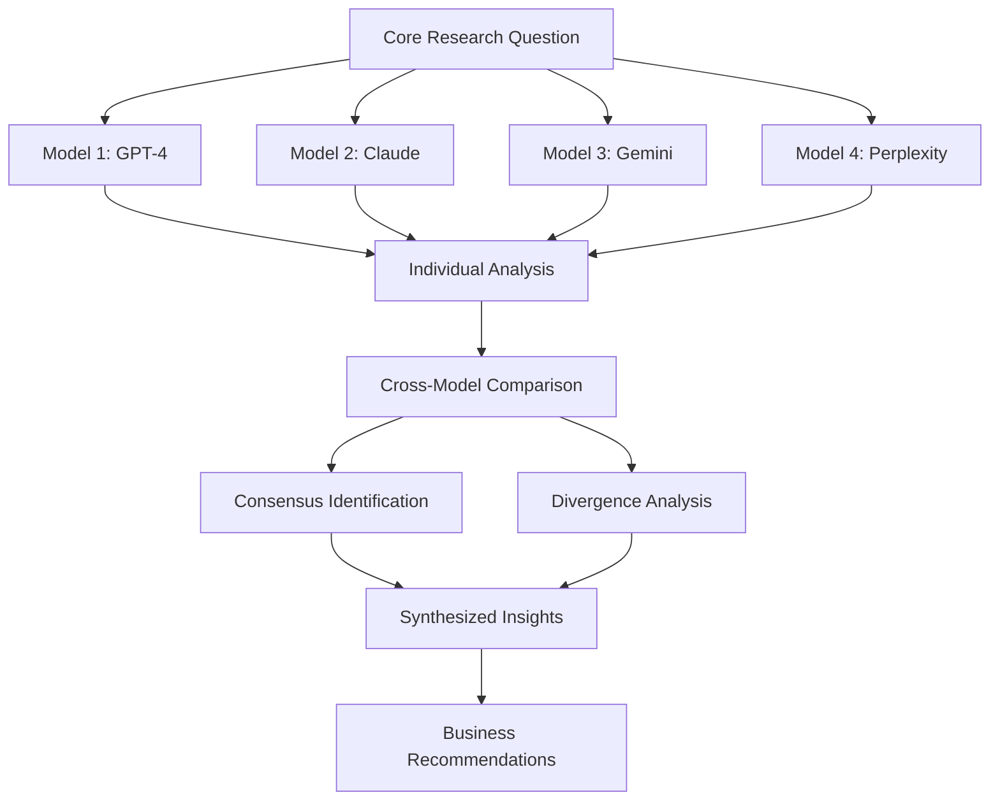

# Multi-Model Research Synthesis: [Research Topic]

**Research Date**: [YYYY-MM-DD]
**Synthesis Completed**: [YYYY-MM-DD]
**Models Consulted**: [List of AI models used]
**Research Coordinator**: [Your name]
**Business Priority**: [High/Medium/Low]

## Research Overview
**Core Question**: [The main business question being researched]
**Business Context**: [Why this research is important for your venture]
**Decision Timeline**: [When decisions based on this research need to be made]

## Models & Methodologies

### AI Models Consulted
| Model | Version | Strengths for This Research | Limitations |
|-------|---------|---------------------------|-------------|
| [GPT-4] | [Version] | [What it's good at] | [Known limitations] |
| [Claude] | [Version] | [What it's good at] | [Known limitations] |
| [Gemini] | [Version] | [What it's good at] | [Known limitations] |
| [Perplexity] | [Version] | [What it's good at] | [Known limitations] |

### Research Approach


## Individual Model Insights

### [Model 1 Name] Analysis
**Unique Perspective**: [What this model emphasized or approached differently]
**Key Insights**:
- [Insight 1]
- [Insight 2]
- [Insight 3]

**Confidence Level**: [Model's stated confidence]
**Sources Cited**: [Any sources this model referenced]

### [Model 2 Name] Analysis
**Unique Perspective**: [What this model emphasized or approached differently]
**Key Insights**:
- [Insight 1]
- [Insight 2]
- [Insight 3]

**Confidence Level**: [Model's stated confidence]
**Sources Cited**: [Any sources this model referenced]

### [Model 3 Name] Analysis
**Unique Perspective**: [What this model emphasized or approached differently]
**Key Insights**:
- [Insight 1]
- [Insight 2]
- [Insight 3]

**Confidence Level**: [Model's stated confidence]
**Sources Cited**: [Any sources this model referenced]

## Cross-Model Analysis

### Strong Consensus Areas
**High Agreement Topics** (3+ models aligned):
1. **[Topic 1]**: [What all models agreed on]
   - **Confidence**: High (multiple model consensus)
   - **Business Impact**: [How this affects your venture]

2. **[Topic 2]**: [What all models agreed on]
   - **Confidence**: High (multiple model consensus)
   - **Business Impact**: [How this affects your venture]

### Moderate Consensus Areas
**Partial Agreement Topics** (2+ models aligned):
1. **[Topic 1]**: [What some models agreed on]
   - **Models in Agreement**: [Which models agreed]
   - **Confidence**: Medium (partial consensus)
   - **Business Impact**: [How this affects your venture]

### Divergent Perspectives
**Areas of Disagreement**:
1. **[Topic 1]**: [Where models disagreed]
   - **Model A Position**: [Perspective 1]
   - **Model B Position**: [Perspective 2]
   - **Analysis**: [Why they might disagree and which might be more accurate]
   - **Resolution Strategy**: [How to resolve the disagreement]

### Novel Insights from Individual Models
**Unique Contributions**:
- **[Model Name]**: [Unique insight only this model provided]
- **[Model Name]**: [Unique insight only this model provided]

## Synthesized Findings

### Primary Conclusions
**High-Confidence Insights** (supported by multiple models):
1. **[Conclusion 1]**: [Synthesized insight with high confidence]
   - **Supporting Models**: [Which models support this]
   - **Business Relevance**: [Why this matters for your venture]

2. **[Conclusion 2]**: [Synthesized insight with high confidence]
   - **Supporting Models**: [Which models support this]
   - **Business Relevance**: [Why this matters for your venture]

### Secondary Insights
**Medium-Confidence Insights** (partial model support or single-model novel insights):
1. **[Insight 1]**: [Insight with moderate confidence]
   - **Rationale**: [Why this is worth considering despite lower confidence]

### Areas Requiring Further Research
**Unresolved Questions**:
- **[Question 1]**: [What still needs to be researched]
- **[Question 2]**: [Areas where models were uncertain or disagreed]

## Validation & Fact-Checking

### Claims Requiring Verification
| Claim | Source Model(s) | Verification Method | Priority | Status |
|-------|----------------|-------------------|----------|--------|
| [Claim 1] | [Model(s)] | [How to verify] | [High/Med/Low] | [Pending/Verified/Disputed] |
| [Claim 2] | [Model(s)] | [How to verify] | [High/Med/Low] | [Pending/Verified/Disputed] |

### Verification Results
**Confirmed Insights**:
- [Insight that was independently verified]
- [Source of verification]

**Disputed or Unclear**:
- [Insight that couldn't be verified or was contradicted]
- [What the verification revealed]

## Business Strategy Implications

### Strategic Recommendations
**High-Priority Actions** (based on high-confidence insights):
1. **[Recommendation 1]**: [Action to take based on research]
   - **Rationale**: [Why this action is recommended]
   - **Timeline**: [When to implement]
   - **Resources Required**: [What's needed to execute]

2. **[Recommendation 2]**: [Action to take based on research]
   - **Rationale**: [Why this action is recommended]
   - **Timeline**: [When to implement]
   - **Resources Required**: [What's needed to execute]

### Risk Mitigation
**Identified Risks**:
- **[Risk 1]**: [Risk identified through research]
  - **Mitigation Strategy**: [How to address this risk]
  - **Monitoring Plan**: [How to track this risk]

### Opportunity Identification
**Market Opportunities**:
- **[Opportunity 1]**: [Opportunity identified through research]
  - **Exploitation Strategy**: [How to capitalize on this opportunity]
  - **Success Metrics**: [How to measure success]

## Implementation Roadmap

### Immediate Actions (Next 2 Weeks)
- [ ] **[Action Item 1]** - Owner: @[Name] - Due: [Date]
- [ ] **[Action Item 2]** - Owner: @[Name] - Due: [Date]

### Short-term Implementation (Next Quarter)
- [ ] **[Strategic Initiative 1]** - [Based on high-confidence insights]
- [ ] **[Strategic Initiative 2]** - [Based on validated research]

### Long-term Considerations (Next Year)
- [ ] **[Long-term Strategy 1]** - [Based on trend analysis]
- [ ] **[Long-term Strategy 2]** - [Based on market evolution predictions]

## Research Quality Assessment

### Overall Confidence Rating
**Synthesis Confidence**: [High/Medium/Low]
**Rationale**: [Why this confidence level is assigned]

### Methodology Strengths
- [What worked well in this multi-model approach]
- [Insights that emerged from model comparison]
- [Validation that increased confidence]

### Methodology Limitations
- [Limitations of the AI models used]
- [Gaps in the research approach]
- [Areas where human expertise is still needed]

## Future Research Directions

### Follow-up Research Needed
1. **[Research Area 1]**: [What additional research would be valuable]
   - **Methodology**: [How to conduct this research]
   - **Timeline**: [When this research should be completed]

2. **[Research Area 2]**: [What additional research would be valuable]
   - **Methodology**: [How to conduct this research]
   - **Timeline**: [When this research should be completed]

### Monitoring & Updates
**Research Refresh Schedule**:
- **Quarterly Review**: [What aspects to re-research regularly]
- **Annual Deep Dive**: [When to conduct comprehensive re-analysis]
- **Trigger Events**: [What events would require immediate research updates]

## Related Documents
- [[Individual AI Research Reports]] - Links to each model's detailed analysis
- [[Business Model Canvas]] - [If research impacts business model]
- [[Strategic Plan]] - [If research affects strategic direction]
- [[Market Analysis]] - [If research contributes to market understanding]

## Appendices

### Appendix A: Research Prompts Used
```
[Model 1 Prompt]: [Exact prompt used]
[Model 2 Prompt]: [Exact prompt used]
[Model 3 Prompt]: [Exact prompt used]
```

### Appendix B: Raw Model Outputs
*[Link to individual research documents for detailed model outputs]*

---

**Tags**: #multi-model-synthesis #ai-research #strategic-analysis #[research-category] #high-confidence
**Created**: [YYYY-MM-DD]
**Last Updated**: [YYYY-MM-DD]
