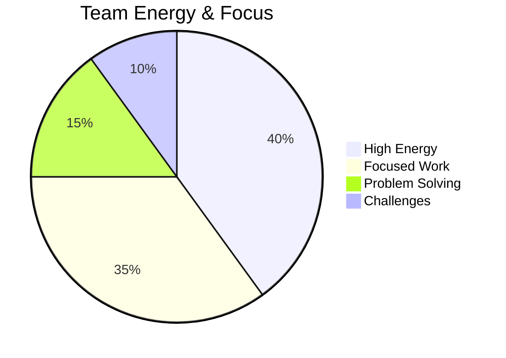
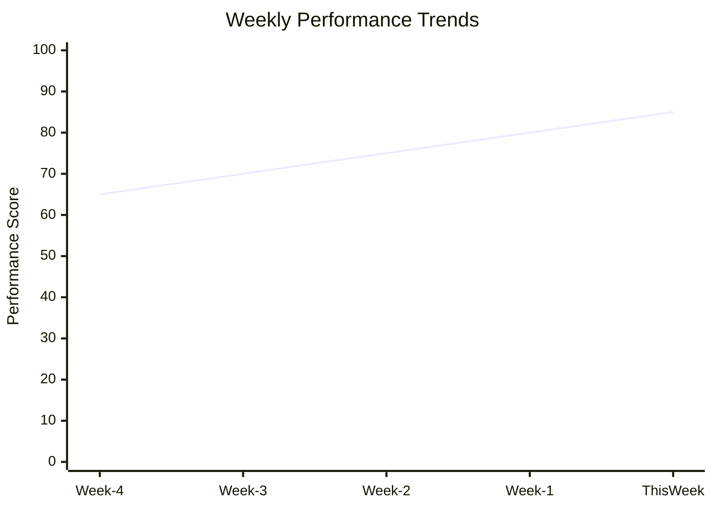

# Weekly Venture Review: Week of [YYYY-MM-DD]

**Review Date**: [YYYY-MM-DD]
**Reviewer**: [Name]
**Week Number**: [Week X of YYYY]
**Venture Stage**: [Ideation/Foundation/Growth/Maturity]

## 📊 Week at a Glance

### Key Metrics
| Metric | This Week | Last Week | Change | Target | Status |
|--------|-----------|-----------|--------|--------|--------|
| Revenue | $[Amount] | $[Amount] | [+/-X%] | $[Target] | [🟢🟡🔴] |
| New Customers | [Number] | [Number] | [+/-X] | [Target] | [🟢🟡🔴] |
| Active Users | [Number] | [Number] | [+/-X%] | [Target] | [🟢🟡🔴] |
| Burn Rate | $[Amount] | $[Amount] | [+/-X%] | $[Target] | [🟢🟡🔴] |
| Team Productivity | [Score] | [Score] | [+/-X] | [Target] | [🟢🟡🔴] |

### Week's Mood

## 🎯 Goals Review

### This Week's Goals (From Last Review)
- [ ] **[Goal 1]** - Status: [Completed/In Progress/Blocked/Deferred]
  - Progress: [Description of progress made]
  - Blockers: [Any obstacles encountered]
  
- [ ] **[Goal 2]** - Status: [Completed/In Progress/Blocked/Deferred]
  - Progress: [Description of progress made]
  - Blockers: [Any obstacles encountered]

- [ ] **[Goal 3]** - Status: [Completed/In Progress/Blocked/Deferred]
  - Progress: [Description of progress made]
  - Blockers: [Any obstacles encountered]

### Goal Achievement Rate
**This Week**: [X]% of goals completed
**4-Week Average**: [X]% of goals completed

## 🚀 Accomplishments & Wins

### Major Wins
- 🎉 **[Win Title]**: [Description and business impact]
- 🎉 **[Win Title]**: [Description and business impact]
- 🎉 **[Win Title]**: [Description and business impact]

### Progress Made
- ✅ **[Achievement]**: [Details and next steps]
- ✅ **[Achievement]**: [Details and next steps]
- ✅ **[Achievement]**: [Details and next steps]

### Customer Feedback Highlights
- 💬 **Positive**: "[Customer quote or feedback summary]"
- 💬 **Constructive**: "[Feedback and our response plan]"

## 🔥 Challenges & Blockers

### Active Blockers
- 🚫 **[Blocker Title]**: 
  - Impact: [High/Medium/Low]
  - Description: [What's blocked and why]
  - Action Plan: [Steps to resolve]
  - Owner: @[Name]
  - Target Resolution: [Date]

### Challenges Overcome
- ⚡ **[Challenge]**: [How we solved it and lessons learned]
- ⚡ **[Challenge]**: [How we solved it and lessons learned]

## 📈 Business Insights

### Market & Competitive Intelligence
- **Market Trend**: [Observation and implications]
- **Competitor Activity**: [What competitors are doing]
- **Opportunity Identified**: [New opportunity and action plan]

### Customer Insights
- **Behavior Pattern**: [What we learned about customer behavior]
- **Feature Request**: [Most requested feature and our plan]
- **Churn Analysis**: [Why customers are leaving and our response]

### Financial Insights
- **Revenue Driver**: [What's driving revenue growth/decline]
- **Cost Optimization**: [Where we're saving/spending money]
- **Cash Flow**: [Current cash position and runway]

## 🔄 Process & Operations

### What's Working Well
- ✅ **[Process/System]**: [Why it's effective]
- ✅ **[Process/System]**: [Why it's effective]

### What Needs Improvement
- 🔧 **[Process/System]**: [What's not working and improvement plan]
- 🔧 **[Process/System]**: [What's not working and improvement plan]

### Team & Culture
- **Team Morale**: [High/Medium/Low] - [Observations and actions]
- **Communication**: [Effectiveness and improvements needed]
- **Skill Gaps**: [Identified gaps and development plans]

## 📅 Next Week's Focus

### Top 3 Priorities
1. **[Priority 1]** - Owner: @[Name] - Due: [Date]
   - Success Criteria: [How we'll measure success]
   - Resources Needed: [What's required]

2. **[Priority 2]** - Owner: @[Name] - Due: [Date]
   - Success Criteria: [How we'll measure success]
   - Resources Needed: [What's required]

3. **[Priority 3]** - Owner: @[Name] - Due: [Date]
   - Success Criteria: [How we'll measure success]
   - Resources Needed: [What's required]

### Key Meetings & Events
- [ ] **[Meeting/Event]** - Date: [Date] - Purpose: [Objective]
- [ ] **[Meeting/Event]** - Date: [Date] - Purpose: [Objective]

### Experiments to Run
- 🧪 **[Experiment Name]**: [Hypothesis and measurement plan]
- 🧪 **[Experiment Name]**: [Hypothesis and measurement plan]

## 🎯 OKR Progress Update

### Current Quarter OKRs
#### Objective 1: [Objective Title]
- **KR1**: [Key Result] - Progress: [X]% - Status: [On Track/At Risk/Off Track]
- **KR2**: [Key Result] - Progress: [X]% - Status: [On Track/At Risk/Off Track]
- **KR3**: [Key Result] - Progress: [X]% - Status: [On Track/At Risk/Off Track]

#### Objective 2: [Objective Title]
- **KR1**: [Key Result] - Progress: [X]% - Status: [On Track/At Risk/Off Track]
- **KR2**: [Key Result] - Progress: [X]% - Status: [On Track/At Risk/Off Track]

## 📊 Data & Analytics

### Key Performance Indicators

### Conversion Funnel
| Stage | This Week | Last Week | Change |
|-------|-----------|-----------|--------|
| Leads | [Number] | [Number] | [+/-X%] |
| Qualified | [Number] | [Number] | [+/-X%] |
| Trials | [Number] | [Number] | [+/-X%] |
| Customers | [Number] | [Number] | [+/-X%] |

## 🤔 Reflections & Learning

### What I Learned This Week
- 📚 **Business Lesson**: [Key insight about the business]
- 📚 **Personal Lesson**: [Personal growth or skill development]
- 📚 **Team Lesson**: [Insight about team dynamics or processes]

### Decisions Made
- 🎯 **[Decision Title]**: [What was decided and rationale]
- 🎯 **[Decision Title]**: [What was decided and rationale]

### Questions for Next Week
- ❓ **[Question]**: [Strategic question to explore]
- ❓ **[Question]**: [Operational question to answer]

## 🔗 Related Documents
- [[Previous Week's Review]]
- [[Monthly Venture Dashboard]]
- [[Current Quarter OKRs]]
- [[Team Meeting Notes]]

## 📝 Action Items
- [ ] **[Action Item]** - Owner: @[Name] - Due: [Date] - Priority: [High/Medium/Low]
- [ ] **[Action Item]** - Owner: @[Name] - Due: [Date] - Priority: [High/Medium/Low]
- [ ] **[Action Item]** - Owner: @[Name] - Due: [Date] - Priority: [High/Medium/Low]

---

**Tags**: #weekly-review #venture #metrics #reflection #planning
**Created**: [YYYY-MM-DD]
**Last Updated**: [YYYY-MM-DD]
