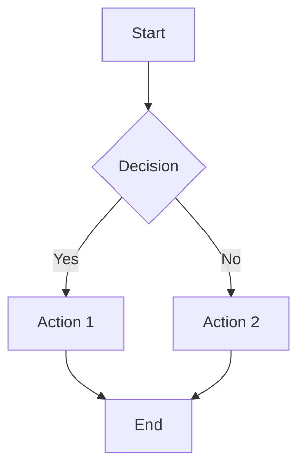
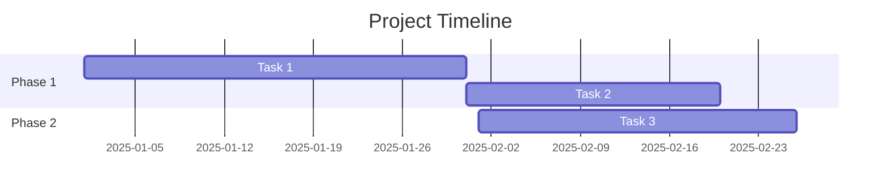
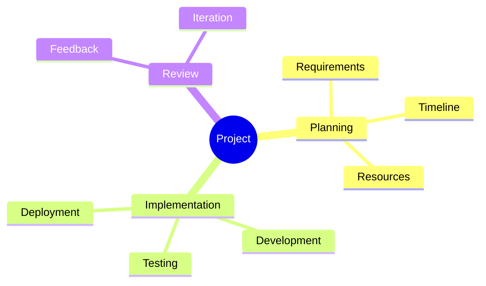

# Windsurf Documentation Rules

This file contains rules and guidelines for AI assistants (like Windsurf/Cascade) when working on this documentation project. These rules ensure consistency, quality, and proper use of Obsidian features.

## Core Documentation Principles

### 1. Structure & Organization
- **ALWAYS** use the established folder structure (strategy, operations, product, research, etc.)
- **ALWAYS** follow naming conventions: lowercase with hyphens, dates in YYYY-MM-DD format
- **ALWAYS** place files in the most appropriate folder based on content type
- **ALWAYS** create README.md files for new folders explaining their purpose

### 2. Markdown Standards
- Use consistent heading hierarchy (# for title, ## for main sections, ### for subsections)
- Use **bold** for emphasis, *italics* for subtle emphasis
- Use `code blocks` for technical terms, file names, and commands
- Use > blockquotes for important notes or warnings
- Always include a blank line before and after headings, lists, and code blocks

### 3. Obsidian Features Integration

#### Wikilinks
- **ALWAYS** use `[[wikilinks]]` to connect related documents
- Use descriptive link text: `[[document-name|Display Text]]` when needed
- Link to related concepts, decisions, and documents throughout content
- Create bidirectional links to build a knowledge graph

#### Tags
- **ALWAYS** include relevant tags at the bottom of documents
- Use consistent tag hierarchy:
  - Primary category: `#strategy`, `#operations`, `#product`, `#research`, `#meetings`, `#vision`
  - Document type: `#business-model`, `#okrs`, `#specs`, `#decision`, `#ai-research`, `#prompts`
  - Status: `#draft`, `#review`, `#approved`, `#archived`
  - Priority: `#high-priority`, `#medium-priority`, `#low-priority`
- Format: `**Tags**: #tag1 #tag2 #tag3`

#### Task Lists
- Use `- [ ]` for incomplete tasks
- Use `- [x]` for completed tasks
- Include assignee when relevant: `- [ ] Task description - @assignee`
- Include due dates: `- [ ] Task description - Due: YYYY-MM-DD`
- Use nested task lists for complex workflows

#### Mermaid Diagrams
- **ALWAYS** use Mermaid for visual representations when helpful
- Common diagram types to use:
  - Flowcharts for processes and decision trees
  - Gantt charts for project timelines
  - Sequence diagrams for interactions
  - Mind maps for brainstorming and concept mapping

## Document Templates & Formatting

### 1. Document Header Format
Every document should start with:
```markdown
# Document Title

**Created**: YYYY-MM-DD
**Last Updated**: YYYY-MM-DD
**Status**: [Draft/Review/Approved/Archived]
**Owner**: [Name or Role]

## Overview
[Brief description of document purpose and scope]
```

### 2. Meeting Notes Requirements
- **ALWAYS** use the meeting notes template
- Include all attendees (including AI assistants)
- Use task lists for action items with assignees and due dates
- Link to related documents and previous meetings
- Include Mermaid diagrams for complex discussions or workflows

### 3. Decision Records Requirements
- **ALWAYS** use the decision record template
- Include all options considered with pros/cons
- Use tables for option comparison when helpful
- Include implementation timeline with task lists
- Link to related decisions and supporting documents

### 4. Planning Documents Requirements
- Include Mermaid Gantt charts for timelines
- Use task lists for milestones and deliverables
- Link to related specifications and business documents
- Include risk assessment with mitigation strategies

## Mermaid Diagram Standards

### Flowcharts


### Gantt Charts


### Mind Maps


## Content Quality Standards

### 1. Completeness
- **ALWAYS** fill in all template sections or remove unused ones
- Include context and background information
- Provide clear next steps and action items
- Link to supporting materials and references

### 2. Clarity
- Use clear, concise language
- Define technical terms and acronyms
- Include examples when helpful
- Structure content logically with appropriate headings

### 3. Consistency
- Follow established naming conventions
- Use consistent terminology throughout
- Maintain consistent formatting and structure
- Apply tags consistently across similar documents

## Workflow Rules

### 1. Document Creation
- **ALWAYS** start with appropriate template from `05-templates/`
- Copy template to correct folder and rename appropriately
- Fill in all relevant sections
- Add appropriate tags and links
- Create initial commit with descriptive message

### 2. Document Updates
- Update "Last Updated" date when making changes
- Add changelog section for significant updates
- Update related documents and links as needed
- Commit changes with descriptive commit messages

### 3. Document Archival
- Move completed documents to `archive/` with appropriate subfolder
- Add "ARCHIVED" prefix to filename
- Update links in active documents
- Include archive reason and date in document header

## Folder Organization Guide

### Document Placement Decision Tree
Use this guide to determine the correct folder for new documents:

#### **strategy/** - Strategic Planning & Business Model
- Business model canvas and iterations
- Strategic plans and roadmaps (3+ months)
- OKRs and quarterly goals
- Vision and mission statements
- Growth strategies and market positioning
- Investment and funding documentation

#### **operations/** - Day-to-Day Business Operations
- Standard operating procedures (SOPs)
- Team structure and hiring processes
- Financial operations and accounting
- Legal and compliance documentation
- Vendor and supplier management
- Process documentation and workflows

#### **product/** - Product Development & Technical Specs
- Technical specifications and requirements
- API documentation and design
- Product roadmaps and feature planning
- User experience and design documentation
- Architecture decisions and technical debt
- Development processes and standards

#### **research/** - All Research & Analysis
- Market research and industry analysis
- Competitive analysis and intelligence
- Customer research and personas
- AI-generated research and insights
- Trend analysis and future predictions
- Research synthesis and cross-analysis

#### **meetings/** - Meeting Notes & Decisions
- Meeting notes and agendas
- Decision records and rationale
- Communication logs and updates
- Action items and follow-ups
- Team retrospectives and reviews

#### **vision/** - Inspirational & Aspirational Content
- Vision boards and goal visualization
- Milestone celebrations and progress
- Inspirational quotes and role models
- Success metrics and achievement tracking
- Personal and lifestyle aspirations

#### **templates/** - Reusable Document Templates
- Document templates for all categories
- Example documents and best practices
- Template instructions and guidelines
- Standardized formats and structures

#### **prompts/** - AI Prompt Library
- Categorized AI prompts by purpose
- Prompt optimization and effectiveness tracking
- Multi-model prompt strategies
- Prompt templates and frameworks

## AI Assistant Guidelines

### When Creating New Documents
1. Ask which folder the document should go in if unclear
2. Use appropriate template from `templates/`
3. Include all required metadata and formatting
4. Add relevant tags and wikilinks
5. Include Mermaid diagrams when they add value
6. Create task lists for actionable items

### When Updating Existing Documents
1. Maintain existing structure and formatting
2. Update "Last Updated" date
3. Add new wikilinks to related content
4. Update task lists and completion status
5. Add changelog entry for significant changes

### When Analyzing or Reviewing
1. Check for consistency with these rules
2. Suggest improvements for clarity and completeness
3. Identify missing links or tags
4. Recommend Mermaid diagrams where helpful
5. Ensure proper folder organization

### When Conducting AI Research
1. **ALWAYS** use the AI research template from `templates/`
2. Document the AI model, version, and research date
3. Include the exact prompt or query used
4. Note confidence levels and limitations stated by the AI
5. Store research in appropriate `research/` subfolder
6. Cross-reference with multiple AI models when possible
7. Create synthesis documents for multi-model research
8. Link AI research to relevant business documents
9. Tag with AI model and research category
10. Include validation status and follow-up actions

### When Using Prompt Library
1. **ALWAYS** check `prompts/` for existing prompts before creating new ones
2. Use proven prompts to ensure consistent, high-quality AI outputs
3. Customize prompts with specific business context before use
4. Document prompt effectiveness and suggest improvements
5. Create new prompts using the prompt template when needed
6. Tag prompts by category, difficulty, and AI model compatibility

### When Creating Vision Content
1. **ALWAYS** connect vision elements to business strategy and planning
2. Use visual elements (images, diagrams, charts) to enhance inspiration
3. Include both aspirational and measurable goals
4. Link vision board elements to OKRs and strategic plans
5. Update vision content regularly based on progress and learnings
6. Store visual assets in appropriate `assets/` subfolders

## File Naming Conventions

### General Rules
- Use lowercase letters only
- Use hyphens (-) instead of spaces or underscores
- Include dates in YYYY-MM-DD format when relevant
- Be descriptive but concise
- Use consistent prefixes for document types

### Examples
- Meeting notes: `2025-12-09-meeting-project-kickoff.md`
- Decision records: `2025-12-09-decision-database-selection.md`
- Project plans: `project-plan-mobile-app.md`
- Specifications: `api-specification-v2.md`
- Business docs: `stakeholder-analysis-q1.md`
- AI research: `2025-12-09-gpt4-market-analysis-saas-trends.md`
- Multi-model synthesis: `2025-12-09-synthesis-competitive-landscape.md`

## Quality Checklist

Before finalizing any document, ensure:
- [ ] Appropriate folder location
- [ ] Correct naming convention
- [ ] All template sections completed or removed
- [ ] Relevant wikilinks added
- [ ] Appropriate tags included
- [ ] Mermaid diagrams where helpful
- [ ] Task lists for actionable items
- [ ] Metadata complete (dates, status, owner)
- [ ] Clear and concise writing
- [ ] Proper markdown formatting
- [ ] Links to related documents

---

**Tags**: #meta #documentation-standards #windsurf-rules #obsidian
**Created**: 2025-12-09
**Last Updated**: 2025-12-09
